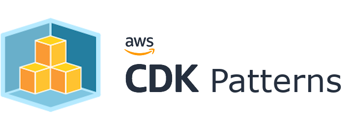

## External Patterns

### AWS Examples

#### [Building enterprise applications using Amazon DynamoDB, AWS Lambda, and Go](https://github.com/aws-samples/aws-dynamodb-enterprise-application/blob/master/README.md) by Geoffroy Rollat

Found via this [tweet](https://twitter.com/danilop/status/1222856997751656449)
* [Tutorial](https://aws.amazon.com/blogs/database/building-enterprise-applications-using-amazon-dynamodb-aws-lambda-and-golang/)
* [GitHub Repo](https://github.com/aws-samples/aws-dynamodb-enterprise-application)

#### [Designing Cloud Native Microservices on AWS (via DDD/EventStormingWorkshop)](https://github.com/aws-samples/designing-cloud-native-microservices-on-aws) by [Kim Kao](https://twitter.com/YiKaiKao)
> Introduce a fluent way to design cloud native microservices via EventStorming workshop, this is a hands-on workshop. Contains such topics: DDD, Event storming, Specification by example. Including the AWS product : Serverless Lambda , DynamoDB, Fargate, CloudWatch.

* [Tutorial / Github](https://github.com/aws-samples/designing-cloud-native-microservices-on-aws)

### Sebastian Müller ([@sbstjn](https://twitter.com/sbstjn), [@superluminario](https://twitter.com/superluminario))

> Full-featured example project based on [create-react-app](https://create-react-app.dev/) with server-side rendering and continuous deployment.

#### [React SPA with server-side rendering on AWS Lambda](https://github.com/sbstjn/cra-serverless/blob/master/README.md)

Found via this [tweet](https://twitter.com/sbstjn/status/1225811582061621250?s=20) and [this](https://twitter.com/superluminario/status/1225779586161684480).

* [Tutorial (English)](https://sbstjn.com/serverless-create-react-app-server-side-rendering-ssr-lamda.html)
* [Tutorial (German)](https://superluminar.io/2020/02/07/react-spa-und-server-side-rendering-ssr-mit-aws-lambda-cloudfront-und-dem-cdk/)
* [GitHub Repo](https://github.com/sbstjn/cra-serverless/blob/master/README.md)

#### Architecture (English)

#### Architecture (German)

