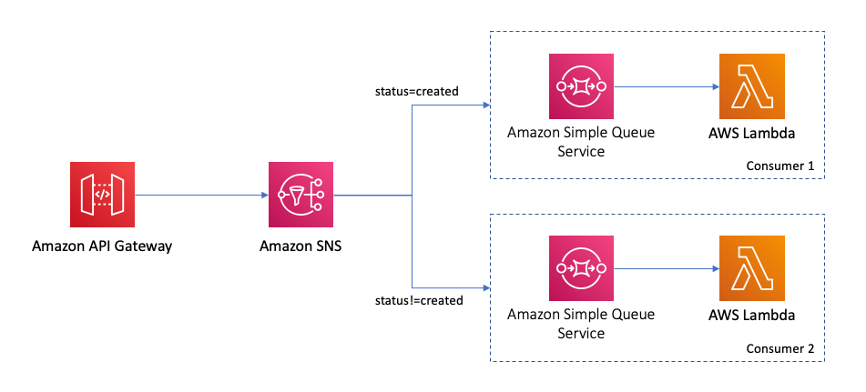
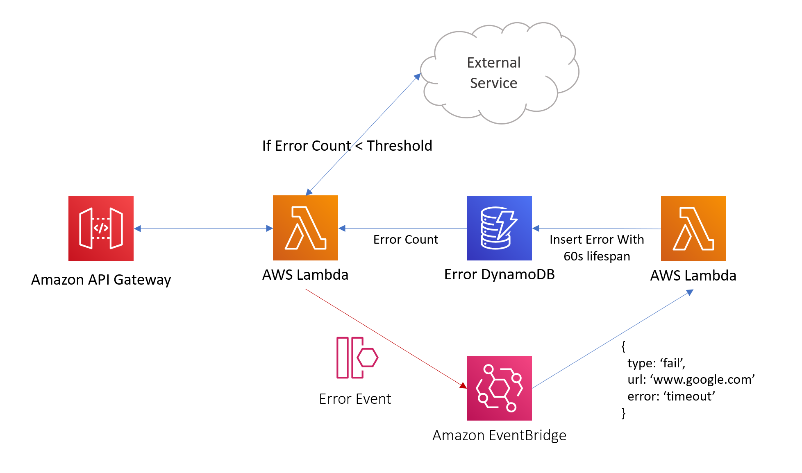
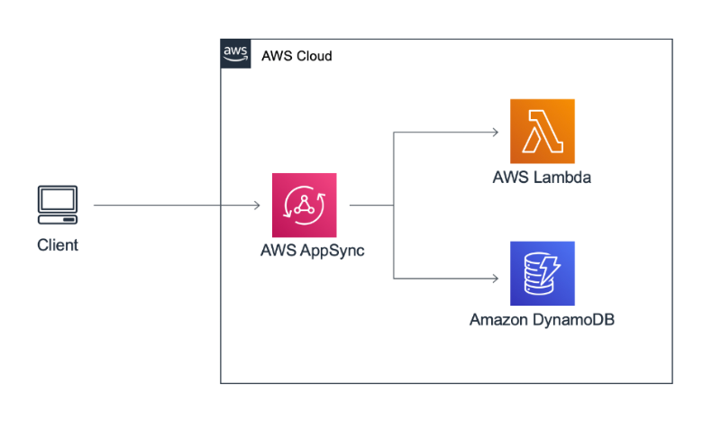

This is intended to be a repo containing all of the official AWS Serverless architecture patterns built with CDK for developers to use.

Follow [@CdkPatterns](https://twitter.com/cdkpatterns) for live discussion / new pattern announcements. I plan to add a new pattern weekly so check back regularly!

Note, this is maintained by [@nideveloper](https://twitter.com/nideveloper) not AWS. For my motivation, please read this [blog post](https://www.mattcoulter.com/blog/post/2)

## New to AWS CDK?

* To learn more visit the [AWS getting started guide](https://docs.aws.amazon.com/cdk/latest/guide/getting_started.html)
* To do a workshop on CDK visit [cdkworkshop.com](https://cdkworkshop.com)
* Visit the [Hey CDK &quot;How To&quot; series](https://garbe.io/blog/2019/09/11/hey-cdk-how-to-migrate/) for some detailed answers
* Check out [Awesome CDK](https://github.com/eladb/awesome-cdk) for a curated list of awesome projects related to CDK

## Pattern Usage
All patterns are available in Typescript and Python so pick your favourite language! Note the Typescript patterns all include unit tests but right now I have not seen a standard python testing approach

You can always clone this repo which contains every pattern in python/typescript but if you just want a single pattern in one language follow these steps:

### 1) Choose your pattern
Browse the "Grouped Alphabetically" patterns list below or run:

```bash
npx cdkp list
```

### 2) Download Pattern In Python or Typescript CDK
<details>
  <summary>TypeScript</summary>
  <br />
  All Patterns support the same commands so you can just run:
  <br />
  
 ```bash
npx cdkp init {pattern-name}
cd {pattern-name}
npm run test
# requires you to be using cloud9 or have ran aws configure to setup your local credentials
npm run deploy 
```
</details>
<details>
  <summary>Python</summary>
  <br />
  The CDK CLI is still installed via npm so make sure you have the latest version of node installed or the npx commands will fail. Then you can just run:
  <br />
  
  ```bash
npx cdkp init {pattern-name} --lang=python
cd {pattern-name}

# create a virtual env and install your dependencies
python -m venv .env
source .env/bin/activate
pip install -r requirements.txt

# test everything is working by outputting the cloudformation
npx cdk synth
# requires you to be using cloud9 or have ran aws configure to setup your local credentials
npx cdk deploy
```
</details>

## Patterns
<details>
  <summary>
    Grouped Alphabetically
  </summary>

  #### Single Page Application S3 Website Deploy
  These are built using https://www.npmjs.com/package/cdk-spa-deploy and allow you to deploy a website in as little as 5 lines of CDK code.

  * [S3 Angular Deploy ](/s3-angular-website/README.md)
  * [S3 React Deploy ](/s3-react-website/README.md)

  

  <br /><hr /><br />

  #### [The Big Fan](/the-big-fan/README.md)  
  You can integrate API Gateway directly with SNS and then add some resiliency by integrating your event consumers via sqs and message filtering.

  

  <br /><hr /><br />

  #### [The Dynamo Streamer](/the-dynamo-streamer/README.md)
  This was taken from this [Tweet](https://twitter.com/edjgeek/status/1220227872511496192?s=20)<br />
  
  You can integrate API Gateway directly with DynamoDB and that way your systems can be more resilient! &quot;Code is a liability&quot; so less lambda functions, less liability

  

  <br /><hr /><br />

  #### [The EventBridge ATM](/the-eventbridge-atm/README.md)
  This was taken from this [Blogpost](https://aws.amazon.com/blogs/compute/integrating-amazon-eventbridge-into-your-serverless-applications/)<br />

  You can easily create routing rules in EventBridge to send the same event to multiple sources based on conditions. This example shows you how<br /><br />

  

  <br /><hr /><br />

  #### [The EventBridge Circuit Breaker](/the-eventbridge-circuit-breaker/README.md)
  Integrate with unreliable external services? Build a circuit breaker and handle the risk <br />
  

  <br /><hr /><br />

  #### [The EventBridge ETL](/the-eventbridge-etl/README.md)
  Build a fully serverless CSV to DynamoDB pipeline <br />
  

  <br /><hr /><br />

  #### [The Scalable Webhook](/the-scalable-webhook/README.md)
  Need to integrate a non serverless resource like RDS with a serverless one like Lambda? This is your pattern <br /><br />
  

  <br /><hr /><br />

  #### [The Simple GraphQL Service](/the-simple-graphql-service/README.md)
  Simple graphQL service built with [AppSync](https://aws.amazon.com/appsync/)<br /><br />
  

  <br /><hr /><br />

  #### [The Simple Webservice](/the-simple-webservice/README.md)
  The most basic pattern on cdkpatterns, the start of most peoples serverless journey <br /><br />
  

  <br /><hr /><br />

  #### [The State Machine](/the-state-machine/README.md)
  Have complex orchestration logic in your application? Build a state machine <br />
  

  <br /><hr /><br />

</details>
<details>
  <summary>
    Grouped By Pattern Creator
  </summary>
  <br />
  
  * [Eric Johnson](#eric-johnson)
  * [Heitor Lessa](#heitor-lessa)
  * [Hervé Nivon](#herve-nivon)
  * [James Beswick](#james-beswick)
  * [Jeremy Daly](#jeremy-daly)
  * [Matt Coulter](#matt-coulter)
  * [Thorsten Hoeger](#thorsten-hoeger)
  * [Vyas Sarangapani](#vyas-sarangapani)

  ### Eric Johnson
  <br />

  Christian, husband, dad of 5, musician, Senior Developer Advocate - Serverless for @AWScloud. Opinions are my own. #Serverless #ServerlessForEveryone<br />

  Twitter - [@edjgeek](https://twitter.com/edjgeek)<br />
  Youtube - [bit.ly/edjgeek](https://bit.ly/edjgeek)<br />

  #### [The Dynamo Streamer](/the-dynamo-streamer/README.md)
  This was taken from this [Tweet](https://twitter.com/edjgeek/status/1220227872511496192?s=20)<br />
  
  You can integrate API Gateway directly with DynamoDB and that way your systems can be more resilient! &quot;Code is a liability&quot; so less lambda functions, less liability

  

  <br /><hr /><br />

  ### Heitor Lessa
  <br />

  Principal Serverless Lead, Well-Architected @ AWS<br />

  Twitter - [@heitor_lessa](https://twitter.com/heitor_lessa)<br />

  #### [The Big Fan](/the-big-fan/README.md)  
  You can integrate API Gateway directly with SNS and then add some resiliency by integrating your event consumers via sqs and message filtering.

  

  <br /><hr /><br />

  ### Hervé Nivon
  <br />

  Startup Solutions Architect @AWScloud ★ Founder ★ Focus on #Innovation, #Cloud, #Startup, #AI ★ #Geek, #Curious & #Epicurean ★<br />

  Twitter - [@hervenivon](https://twitter.com/hervenivon) <br />
  Github - [@hervenivon](https://github.com/hervenivon/aws-experiments-data-ingestion-and-analytics) <br />

  #### [The EventBridge ETL](/the-eventbridge-etl/README.md)
  Build a fully serverless CSV to DynamoDB pipeline <br />
  

  <br /><hr /><br />

  ### James Beswick
  <br />

  ☁️🥑 Dev Advocate @AWScloud Serverless<br />

  Twitter - [@jbesw](https://twitter.com/jbesw) <br />
  Blog - [medium.com/@jbesw](https://medium.com/@jbesw)<br />

  #### [The EventBridge ATM](/the-eventbridge-atm/README.md)
  This was taken from this [Blogpost](https://aws.amazon.com/blogs/compute/integrating-amazon-eventbridge-into-your-serverless-applications/)<br />

  You can easily create routing rules in EventBridge to send the same event to multiple sources based on conditions. This example shows you how<br /><br />

  

  <br /><hr /><br />

  ### Jeremy Daly
  <br />

  AWS Serverless Hero/🥑 & host of @ServerlessChats. I build web & open source stuff, blog, speak, and publish http://OffByNone.io every week. CTO @AlertMeNews.<br />

  Twitter - [@jeremy_daly](https://twitter.com/jeremy_daly) <br />
  Blog - [jeremydaly.com](https://www.jeremydaly.com/) <br />

  These patterns are from https://www.jeremydaly.com/serverless-microservice-patterns-for-aws/

  #### [The Simple Webservice](/the-simple-webservice/README.md)
  The most basic pattern on cdkpatterns, the start of most peoples serverless journey <br /><br />
  

  #### [The Scalable Webhook](/the-scalable-webhook/README.md)
  Need to integrate a non serverless resource like RDS with a serverless one like Lambda? This is your pattern <br /><br />
  

  #### [The State Machine](/the-state-machine/README.md)
  Have complex orchestration logic in your application? Build a state machine <br />
  

  #### [The EventBridge Circuit Breaker](/the-eventbridge-circuit-breaker/README.md)
  Integrate with unreliable external services? Build a circuit breaker and handle the risk <br />
  

  <br /><hr /><br />

  ### Matt Coulter
  <br />

  Software Architect, working for @Liberty_IT in Belfast. Passionate about #Serverless, #AWS, @cdkpatterns, #TCO, CI/CD and #TrunkBasedDev.<br />

  Twitter - [@nideveloper](https://twitter.com/nideveloper) <br />
  Blog - [mattcoulter.com](https://www.mattcoulter.com) <br />
  
  #### Single Page Application S3 Website Deploy
  These are built using https://www.npmjs.com/package/cdk-spa-deploy and allow you to deploy a website in as little as 5 lines of CDK code.

  * [S3 Angular Deploy ](/s3-angular-website/README.md)
  * [S3 React Deploy ](/s3-react-website/README.md)

  

  <br /><hr /><br />

  ### Thorsten Hoeger
  <br />

  Cloud Evangelist, CEO @ Taimos GmbH [@taimosgmbh](https://twitter.com/taimosgmbh) - [AWS Community Hero](http://aws.amazon.com/de/heroes/) - AWS, Alexa, Serverless, Gemeinderat [@fw_reichenbach](https://twitter.com/fw_reichenbach)<br />

  Twitter - [@hoegertn](https://twitter.com/hoegertn) <br />
  LinkTree - [@hoegertn](https://linktr.ee/hoegertn) <br />

  #### [The Simple GraphQL Service](/the-simple-graphql-service/README.md)
  Simple graphQL service built with [AppSync](https://aws.amazon.com/appsync/)<br /><br />
  

  ### Vyas Sarangapani
  <br />

  Software Developer, SAP Cloud Applications Architect, Block chain Evangelist, Marathoner, Ultra Runner, Information Junkie, Ambivert<br />

  Twitter - [@madladvyas](https://twitter.com/madladvyas) <br />
  Medium - [@svyasrao22](https://medium.com/@svyasrao22) <br />

  #### [The EventBridge ETL](/the-eventbridge-etl/README.md)
  Build a fully serverless CSV to DynamoDB pipeline <br />
  
  

</details>
<details>
  <summary>
    Resiliency Focused Patterns
  </summary>

  #### [The Big Fan](/the-big-fan/README.md)  
  You can integrate API Gateway directly with SNS and then add some resiliency by integrating your event consumers via sqs and message filtering.

  

  <br /><hr /><br />

  #### [The Dynamo Streamer](/the-dynamo-streamer/README.md)
  This was taken from this [Tweet](https://twitter.com/edjgeek/status/1220227872511496192?s=20)<br />
  
  You can integrate API Gateway directly with DynamoDB and that way your systems can be more resilient! &quot;Code is a liability&quot; so less lambda functions, less liability

  

  <br /><hr /><br />

  #### [The EventBridge Circuit Breaker](/the-eventbridge-circuit-breaker/README.md)
  Integrate with unreliable external services? Build a circuit breaker and handle the risk <br />
  

  <br /><hr /><br />

  #### [The Scalable Webhook](/the-scalable-webhook/README.md)
  Need to integrate a non serverless resource like RDS with a serverless one like Lambda? This is your pattern <br /><br />
  

  <br /><hr /><br />

</details>

## External Patterns

[External Patterns Page](EXTERNAL_PATTERNS.md)

## Contributing
I hope for this to be something the whole cdk community contributes to so feel free to fork this repo and open up a pull request. For full details see our [Contributing Guidelines](CONTRIBUTING.md)
