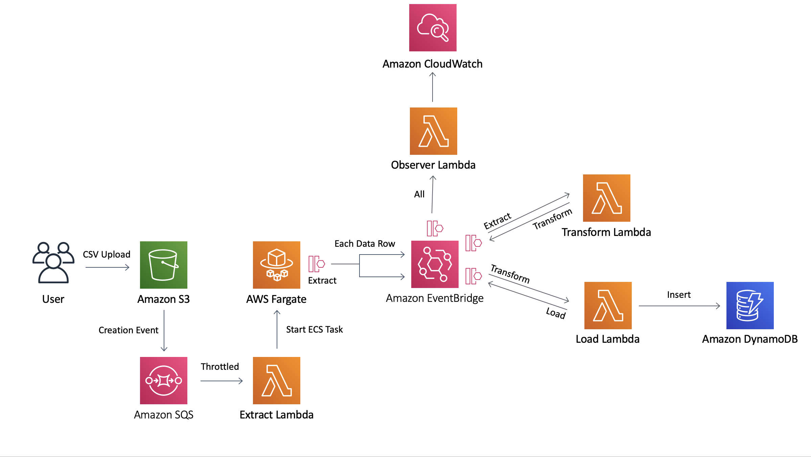
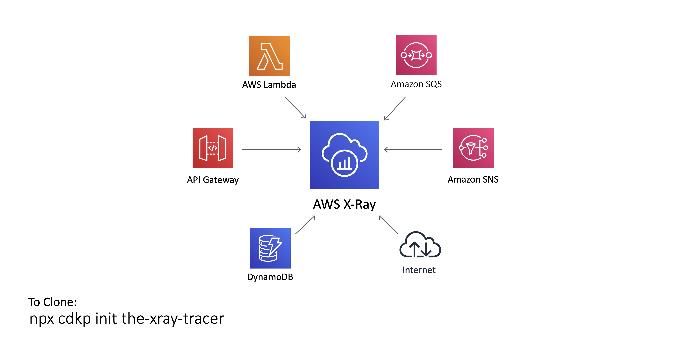

This is intended to be a repo containing all of the official AWS Serverless architecture patterns built with AWS CDK for developers to use.

Follow [@CdkPatterns](https://twitter.com/cdkpatterns) for live discussion / new pattern announcements. I plan to add a new pattern weekly so check back regularly!

You can also check out our [Deconstructing CDKPatterns](https://www.youtube.com/channel/UCuR3jnWEnxx1G2axUMVaogg) YouTube channel for in depth walk throughs of the patterns.

Note, this is maintained by [@nideveloper](https://twitter.com/nideveloper) not AWS. For my motivation, please read this [blog post](https://www.mattcoulter.com/blog/post/2)

## New to AWS CDK?

* To learn more visit the [AWS getting started guide](https://docs.aws.amazon.com/cdk/latest/guide/getting_started.html)
* To do a workshop on CDK visit [cdkworkshop.com](https://cdkworkshop.com)
* Visit the [Hey CDK &quot;How To&quot; series](https://garbe.io/blog/2019/09/11/hey-cdk-how-to-migrate/) for some detailed answers
* Check out [Awesome CDK](https://github.com/eladb/awesome-cdk) for a curated list of awesome projects related to CDK

## Pattern Usage
All patterns are available in Typescript and Python so pick your favourite language! Note the Typescript patterns all include unit tests but right now I have not seen a standard python testing approach

You can always clone this repo which contains every pattern in python/typescript but if you just want a single pattern in one language follow these steps:

### 1) Choose your pattern
Browse the "Grouped Alphabetically" patterns list below or run:

```bash
npx cdkp list
```

### 2) Download Pattern In Python or Typescript CDK
>Something to be aware of is that the Python version may reuse the JS lambdas from the TypeScript version. This is to reduce the amount of development effort when creating these patterns. It means at launch the TypeScript and Python patterns are effectively identical when deployed but you get the choice of Python or TypeScript for the CDK implementation.
>
>I will look to refactor the Python patterns slowly to full Python after initial launch. If you want to help with this effort, pull requests are always welcome!
<details>
  <summary>TypeScript</summary>
  <br />
  All Patterns support the same commands so you can just run:
  <br />
  
 ```bash
npx cdkp init {pattern-name}
cd {pattern-name}
npm run test
# requires you to be using cloud9 or have ran aws configure to setup your local credentials
npm run deploy 
```
</details>
<details>
  <summary>Python</summary>
  <br />
  The CDK CLI is still installed via npm so make sure you have the latest version of node installed or the npx commands will fail. Then you can just run:
  <br />
  
  ```bash
npx cdkp init {pattern-name} --lang=python
cd {pattern-name}

# create a virtual env and install your dependencies
python -m venv .env
source .env/bin/activate
pip install -r requirements.txt

# test everything is working by outputting the cloudformation
npx cdk synth
# requires you to be using cloud9 or have ran aws configure to setup your local credentials
npx cdk deploy
```
</details>

## Patterns

[The Filter Pattern By Component Used Page](https://www.serverless-patterns.co.uk/patterns/) allows you to filter patterns by a serverless component e.g. Lambda or API Gateway HTTP API visit, otherwise:

<details>
  <summary>
    Grouped Alphabetically
  </summary>

  #### [Polly](/polly/README.md)
  Use Amazon Polly to translate text to speech from inside a Lambda Function. You can also take advantage of Amazon Translate to change the language of the spoken text

  

  <br /><hr /><br />

  #### Single Page Application S3 Website Deploy
  These are built using https://www.npmjs.com/package/cdk-spa-deploy and allow you to deploy a website in as little as 5 lines of CDK code.

  * [S3 Angular Deploy ](/s3-angular-website/README.md)
  * [S3 React Deploy ](/s3-react-website/README.md)

  

  <br /><hr /><br />

  #### [The Alexa Skill](/the-alexa-skill/README.md)  
  Deploy an Alexa Skill backed by a Lambda Function and a DynamoDB Table.

  

  <br /><hr /><br />

  #### [The Basic MQ](/the-basic-mq/README.md)  
  In this example we have private Amazon MQ brokers behind an internet-facing network load balancer endpoint using a subdomain.

  

  <br /><hr /><br />

  #### [The Big Fan](/the-big-fan/README.md)  
  You can integrate API Gateway directly with SNS and then add some resiliency by integrating your event consumers via sqs and message filtering.

  

  <br /><hr /><br />

  #### [The CloudWatch Dashboard](/the-cloudwatch-dashboard/README.md)  
  Build and deploy a well architected CloudWatch dashboard with alerts for the simple webservice pattern

  

  <br /><hr /><br />

  #### [The Destined Lambda](/the-destined-lambda/README.md)
  This is a stock implementation of Lambda Destinations with Amazon EventBridge
  
  You can decouple your event driven architectures with EventBridge rules and now you can strip the custom EventBridge code from your Lambda functions with Lambda Destinations.

  

  <br /><hr /><br />

  #### [The Dynamo Streamer](/the-dynamo-streamer/README.md)
  This was taken from this [Tweet](https://twitter.com/edjgeek/status/1220227872511496192?s=20)<br />
  
  You can integrate API Gateway directly with DynamoDB and that way your systems can be more resilient! &quot;Code is a liability&quot; so less lambda functions, less liability

  

  <br /><hr /><br />

  #### [The EFS Lambda](/the-efs-lambda/README.md)
  This was taken from this [Blogpost](https://aws.amazon.com/blogs/aws/new-a-shared-file-system-for-your-lambda-functions/)<br />

  You can now attach an EFS File System to your Lambda Function for persistence between executions or across different Functions <br /><br />

  

  <br /><hr /><br />

  #### [The EventBridge ATM](/the-eventbridge-atm/README.md)
  This was taken from this [Blogpost](https://aws.amazon.com/blogs/compute/integrating-amazon-eventbridge-into-your-serverless-applications/)<br />

  You can easily create routing rules in EventBridge to send the same event to multiple sources based on conditions. This example shows you how<br /><br />

  

  <br /><hr /><br />

  #### [The EventBridge Circuit Breaker](/the-eventbridge-circuit-breaker/README.md)
  Integrate with unreliable external services? Build a circuit breaker and handle the risk <br />
  

  <br /><hr /><br />

  #### [The EventBridge ETL](/the-eventbridge-etl/README.md)
  Build a fully serverless CSV to DynamoDB pipeline <br />
  

  <br /><hr /><br />

  #### [The Lambda Circuit Breaker](/the-lambda-circuit-breaker/README.md)
  Deploy Gunnar Grosch's circuitbreaker-lambda inside a reference architecture

  

  <br /><hr /><br />

  #### [The Lambda Power Tuner](/the-lambda-power-tuner/README.md)
  Use the Lambda Power Tuner state machine to work out the optimum configuration settings for your Lambda Function

  

  <br /><hr /><br />

  #### [The Lambda Trilogy](the-lambda-trilogy/README.md)
  See the 3 states of Lambda in action (Single Purpose Function, Fat Lambda and Lambda-lith)
  

  <br /><hr /><br />

  #### [The Media Live Stream](the-media-live-stream/README.md)
  This is an example of how to deploy a Serverless environment to stream live event content.
  

  <br /><hr /><br />

  #### [The Predictive Lambda](the-predictive-lambda/README.md)
  Deploy a custom Python ML model inside a Docker container running on AWS Lambda
  

  <br /><hr /><br />

  #### [The RDS Proxy](the-rds-proxy/README.md)
  Use RDS Proxy to protect a MySQL RDS Instance from the massively scalable Lambda Function querying it
  

  <br /><hr /><br />

  #### [The Saga Step Function](the-saga-stepfunction/README.md)
  A mechanism for handling distributed transactions within your system.
  

  <br /><hr /><br />

  #### [The Scalable Webhook](/the-scalable-webhook/README.md)
  Need to integrate a non serverless resource like RDS with a serverless one like Lambda? This is your pattern <br /><br />
  

  <br /><hr /><br />

  #### [The Scheduled Lambda](/the-scheduled-lambda/README.md)
  Use EventBridge to trigger a Lambda Fuction on a schedule <br /><br />
  

  <br /><hr /><br />

  #### [The Simple GraphQL Service](/the-simple-graphql-service/README.md)
  Simple graphQL service built with [AppSync](https://aws.amazon.com/appsync/)<br /><br />
  

  <br /><hr /><br />

  #### [The Simple Webservice](/the-simple-webservice/README.md)
  The most basic pattern on cdkpatterns, the start of most peoples serverless journey <br /><br />
  

  <br /><hr /><br />

  #### [The State Machine](/the-state-machine/README.md)
  Have complex orchestration logic in your application? Build a state machine <br />
  

  <br /><hr /><br />

  #### [The WAF API Gateway](/the-waf-apigateway/README.md)
  This is a cdk stack to deploy a simple API gateway, and attach a WAF (Web Applicaiton Firewall) <br />
  

  <br /><hr /><br />

  #### [The X-Ray Tracer](the-xray-tracer/README.md)
  Learn about using AWS X-Ray for tracing events through your system. This pattern has X-Ray enabled on API Gateway, Lambda, DynamoDB, External HTTP calls, SNS and SQS
  
  

  <br /><hr /><br />

</details>
<details>
  <summary>
    Grouped By Pattern Creator
  </summary>
  <br />
  
  * [Alex Casalboni](#alex-casalboni)
  * [Andrew Frazer](#andrew-frazer)
  * [Ariadna Sanchez](#ariadna-sanchez)
  * [Chris Plankey](#chris-plankey)
  * [Christian Mueller](#christian-mueller)
  * [Danilo Poccia](#danilo-poccia)
  * [Eric Johnson](#eric-johnson)
  * [Gerald Stewart](#gerald-stewart)
  * [Gunnar Grosch](#gunnar-grosch)
  * [Heitor Lessa](#heitor-lessa)
  * [Hervé Nivon](#hervé-nivon)
  * [James Beswick](#james-beswick)
  * [Jeremy Daly](#jeremy-daly)
  * [Joppe Pelzer](#joppe-pelzer)
  * [Leandro Damascena](#leandro-damascena)
  * [Matt Coulter](#matt-coulter)
  * [Thorsten Hoeger](#thorsten-hoeger)
  * [Vyas Sarangapani](#vyas-sarangapani)
  * [Wallace Printz](#wallace-printz)
  * [Yan Cui](#yan-cui)

  ### Alex Casalboni
  <br />

  Musician, Traveler, Software Engineer from Italy. Developer Advocate at @AWS_Italy<br />

  Twitter - [@alex_casalboni](https://twitter.com/alex_casalboni)<br />

  #### [The Lambda Power Tuner](/the-lambda-power-tuner/README.md)
  Use the Lambda Power Tuner state machine to work out the optimum configuration settings for your Lambda Function

  

  <br /><hr /><br />

  ### Andrew Frazer
  <br />

  Github - [@mrpackethead](https://github.com/mrpackethead)<br />

  #### [The WAF API Gateway](/the-waf-apigateway/README.md)
  This is a cdk stack to deploy a simple API gateway, and attach a WAF (Web Applicaiton Firewall) <br />
  

  <br /><hr /><br />

  ### Ariadna Sanchez
  <br />

  Ariadna Sanchez is a Research Scientist investigating the application of DL/ML technologies in the area of text-to-speech. After completing a bachelor’s in Audiovisual Systems Engineering, she received her MSc in Speech and Language Processing from University of Edinburgh in 2018. She has previously worked as an intern in NLP and TTS. During her time at University, she focused on TTS and signal processing, especially in the dysarthria field. She has experience in Signal Processing, Deep Learning, NLP, Speech and Image Processing. In her free time, Ariadna likes playing the violin, reading books and playing games.<br />

  #### [Polly](/polly/README.md)  
  Use Amazon Polly to translate text to speech from inside a Lambda Function. You can also take advantage of Amazon Translate to change the language of the spoken text

  

  <br /><hr /><br />

  ### Chris Plankey
  <br />

  CTO of MaverickApp.io, AWS Portsmouth User Group Co-Organizer and AWS Community Builder.<br />

  Github - [@cplankey](https://github.com/cplankey) <br />
  Twitter - [@serverlesschris](https://twitter.com/serverlesschris) <br />

  #### [The Alexa Skill](/the-alexa-skill/README.md)  
  Deploy an Alexa Skill backed by a Lambda Function and a DynamoDB Table.

  

  <br /><hr /><br />

  ### Christian Mueller
  <br />

  Solutions Architect @ AWS & Apache Member @ ASF<br />

  Github - [@muellerc](https://github.com/muellerc) <br />

  #### [The Basic MQ](/the-basic-mq/README.md)  
  In this example we have private Amazon MQ brokers behind an internet-facing network load balancer endpoint using a subdomain.
  

  <br /><hr /><br />

  ### Danilo Poccia
  <br />

  Chief Evangelist (EMEA) @AWSCloud. Mostly Serverless, IoT, AI/ML. Few pics. Some music. My opinions. Complexity is a science. http://pronoun.is/he<br />

  Twitter - [@danilop](https://twitter.com/danilop)<br />

  #### [The EFS Lambda](/the-efs-lambda/README.md)
  This was taken from this [Blogpost](https://aws.amazon.com/blogs/aws/new-a-shared-file-system-for-your-lambda-functions/)<br />

  You can now attach an EFS File System to your Lambda Function for persistence between executions or across different Functions <br /><br />

  

  <br /><hr /><br />

  ### Eric Johnson
  <br />

  Christian, husband, dad of 5, musician, Senior Developer Advocate - Serverless for @AWScloud. Opinions are my own. #Serverless #ServerlessForEveryone<br />

  Twitter - [@edjgeek](https://twitter.com/edjgeek)<br />
  Youtube - [bit.ly/edjgeek](https://bit.ly/edjgeek)<br />

  #### [The Dynamo Streamer](/the-dynamo-streamer/README.md)
  This was taken from this [Tweet](https://twitter.com/edjgeek/status/1220227872511496192?s=20)<br />
  
  You can integrate API Gateway directly with DynamoDB and that way your systems can be more resilient! &quot;Code is a liability&quot; so less lambda functions, less liability

  

  <br /><hr /><br />

  ### Gerald Stewart
  <br />

  Software Engineer @Liberty_IT<br />

  Twitter - [@_gerald20](https://twitter.com/_gerald20)<br />

  #### [The Scheduled Lambda](/the-scheduled-lambda/README.md)
  Use EventBridge to trigger a Lambda Fuction on a schedule <br /><br />

  

  <br /><hr /><br />

  ### Gunnar Grosch
  <br />

  Senior Developer Advocate @awscloud<br />

  Twitter - [@GunnarGrosch](https://twitter.com/GunnarGrosch)<br />
  Blog - [grosch.se](https://grosch.se/)<br />

  #### [The Lambda Circuit Breaker](/the-lambda-circuit-breaker/README.md)
  Deploy Gunnar Grosch's circuitbreaker-lambda inside a reference architecture

  


  <br /><hr /><br />

  ### Heitor Lessa
  <br />

  Principal Serverless Lead, Well-Architected @ AWS<br />

  Twitter - [@heitor_lessa](https://twitter.com/heitor_lessa)<br />

  #### [The Big Fan](/the-big-fan/README.md)  
  You can integrate API Gateway directly with SNS and then add some resiliency by integrating your event consumers via sqs and message filtering.

  

  #### [The Saga Step Function](the-saga-stepfunction/README.md)
  A mechanism for handling distributed transactions within your system.
  

  <br /><hr /><br />

  ### Hervé Nivon
  <br />

  Startup Solutions Architect @AWScloud ★ Founder ★ Focus on #Innovation, #Cloud, #Startup, #AI ★ #Geek, #Curious & #Epicurean ★<br />

  Twitter - [@hervenivon](https://twitter.com/hervenivon) <br />
  Github - [@hervenivon](https://github.com/hervenivon/aws-experiments-data-ingestion-and-analytics) <br />

  #### [The EventBridge ETL](/the-eventbridge-etl/README.md)
  Build a fully serverless CSV to DynamoDB pipeline <br />
  

  <br /><hr /><br />

  ### James Beswick
  <br />

  ☁️🥑 Dev Advocate @AWScloud Serverless<br />

  Twitter - [@jbesw](https://twitter.com/jbesw) <br />
  Blog - [medium.com/@jbesw](https://medium.com/@jbesw)<br />

  #### [The EventBridge ATM](/the-eventbridge-atm/README.md)
  This was taken from this [Blogpost](https://aws.amazon.com/blogs/compute/integrating-amazon-eventbridge-into-your-serverless-applications/)<br />

  You can easily create routing rules in EventBridge to send the same event to multiple sources based on conditions. This example shows you how<br /><br />

  

  <br /><hr /><br />

  ### Jeremy Daly
  <br />

  AWS Serverless Hero/🥑 & host of @ServerlessChats. I build web & open source stuff, blog, speak, and publish http://OffByNone.io every week. CTO @AlertMeNews.<br />

  Twitter - [@jeremy_daly](https://twitter.com/jeremy_daly) <br />
  Blog - [jeremydaly.com](https://www.jeremydaly.com/) <br />

  These patterns are from https://www.jeremydaly.com/serverless-microservice-patterns-for-aws/

  #### [The Lambda Trilogy](the-lambda-trilogy/README.md)
  See the 3 states of Lambda in action (Single Purpose Function, Fat Lambda and Lambda-lith)
  

  #### [The Simple Webservice](/the-simple-webservice/README.md)
  The most basic pattern on cdkpatterns, the start of most peoples serverless journey <br /><br />
  

  #### [The Scalable Webhook](/the-scalable-webhook/README.md)
  Need to integrate a non serverless resource like RDS with a serverless one like Lambda? This is your pattern <br /><br />
  

  #### [The State Machine](/the-state-machine/README.md)
  Have complex orchestration logic in your application? Build a state machine <br />
  

  #### [The EventBridge Circuit Breaker](/the-eventbridge-circuit-breaker/README.md)
  Integrate with unreliable external services? Build a circuit breaker and handle the risk <br />
  

  <br /><hr /><br />

  ### Joppe Pelzer
  <br />

  Joppe Pelzer is a Language Engineer working on text-to-speech for English and building style voices. With bachelor’s degrees in linguistics and Scandinavian languages, she graduated from Edinburgh University with an MSc in Speech and Language Processing in 2018. During her masters she focused on the text-to-speech front end, building and expanding upon multilingual G2P models, and has gained experience with NLP, Speech recognition and Deep Learning. Outside of work, she likes to draw, play games, and spend time in nature.<br />

  #### [Polly](/polly/README.md)  
  Use Amazon Polly to translate text to speech from inside a Lambda Function. You can also take advantage of Amazon Translate to change the language of the spoken text

  

  <br /><hr /><br />

  ### Leandro Damascena
  <br />

  Cloud Solutions Architect, Writer http://leandrodamascena.medium.com and Open-source enthusiast.<br />

  #### [The Media Live Stream](the-media-live-stream/README.md)
  This is an example of how to deploy a Serverless environment to stream live event content.
  

  <br /><hr /><br />

  ### Matt Coulter
  <br />

  Software Architect, working for @Liberty_IT in Belfast. Passionate about #Serverless, #AWS, @cdkpatterns, #TCO, CI/CD and #TrunkBasedDev.<br />

  Twitter - [@nideveloper](https://twitter.com/nideveloper) <br />
  Blog - [mattcoulter.com](https://www.mattcoulter.com) <br />
  
  #### Single Page Application S3 Website Deploy
  These are built using https://www.npmjs.com/package/cdk-spa-deploy and allow you to deploy a website in as little as 5 lines of CDK code.

  * [S3 Angular Deploy ](/s3-angular-website/README.md)
  * [S3 React Deploy ](/s3-react-website/README.md)

  

  #### [The CloudWatch Dashboard](/the-cloudwatch-dashboard/README.md)  
  Build and deploy a well architected CloudWatch dashboard with alerts for the simple webservice pattern

  

  #### [The Destined Lambda](/the-destined-lambda/README.md)
  This is a stock implementation of Lambda Destinations with Amazon EventBridge
  
  You can decouple your event driven architectures with EventBridge rules and now you can strip the custom EventBridge code from your Lambda functions with Lambda Destinations.

  

  #### [The Predictive Lambda](the-predictive-lambda/README.md)

  Deploy a custom Python ML model inside a Docker container running on AWS Lambda
  
  

  #### [The RDS Proxy](the-rds-proxy/README.md)
  Use RDS Proxy to protect a MySQL RDS Instance from the massively scalable Lambda Function querying it
  
  


  #### [The X-Ray Tracer](the-xray-tracer/README.md)
  Learn about using AWS X-Ray for tracing events through your system. This pattern has X-Ray enabled on API Gateway, Lambda, DynamoDB, External HTTP calls, SNS and SQS
  
  

  <br /><hr /><br />

  ### Thorsten Hoeger
  <br />

  Cloud Evangelist, CEO @ Taimos GmbH [@taimosgmbh](https://twitter.com/taimosgmbh) - [AWS Community Hero](http://aws.amazon.com/de/heroes/) - AWS, Alexa, Serverless, Gemeinderat [@fw_reichenbach](https://twitter.com/fw_reichenbach)<br />

  Twitter - [@hoegertn](https://twitter.com/hoegertn) <br />
  LinkTree - [@hoegertn](https://linktr.ee/hoegertn) <br />

  #### [The Simple GraphQL Service](/the-simple-graphql-service/README.md)
  Simple graphQL service built with [AppSync](https://aws.amazon.com/appsync/)<br /><br />
  

  ### Vyas Sarangapani
  <br />

  Software Developer, SAP Cloud Applications Architect, Block chain Evangelist, Marathoner, Ultra Runner, Information Junkie, Ambivert<br />

  Twitter - [@madladvyas](https://twitter.com/madladvyas) <br />
  Medium - [@svyasrao22](https://medium.com/@svyasrao22) <br />

  #### [The EventBridge ETL](/the-eventbridge-etl/README.md)
  Build a fully serverless CSV to DynamoDB pipeline <br />
  

  ### Wallace Printz
  <br />

  Wallace Printz is a Senior Solutions Architect based in Austin, Texas. He helps customers across Texas transform their businesses in the cloud. He has a background in Semiconductors, R&D, and Machine Learning.<br />

  Twitter - [@WallacePrintz](https://twitter.com/WallacePrintz) <br />
  Github - [@WPrintz](https://github.com/WPrintz) <br />

  #### [The Basic MQ](/the-basic-mq/README.md)  
  In this example we have private Amazon MQ brokers behind an internet-facing network load balancer endpoint using a subdomain.
  

  ### Yan Cui
  <br />

  AWS Serverless Hero | Independent Consultant | Author | Trainer | Speaker | Developer Advocate at [@Lumigo](https://twitter.com/Lumigo) | Teacher of [@LearnLambda](https://twitter.com/LearnLambda) | Host of [@RealWorldSls](https://twitter.com/RealWorldSls)

  Twitter - [@theburningmonk](https://twitter.com/theburningmonk) <br />
  Blog - [theburningmonk.com](https://theburningmonk.com/) <br />

  #### [The Lambda Trilogy](the-lambda-trilogy/README.md)
  See the 3 states of Lambda in action (Single Purpose Function, Fat Lambda and Lambda-lith)
  

  #### [The Saga Step Function](the-saga-stepfunction/README.md)
  A mechanism for handling distributed transactions within your system.
  

</details>

## Serverless Well Architected Pattern Matcher

The [AWS Well-Architected](https://aws.amazon.com/architecture/well-architected/) Framework helps you understand the pros and cons of
decisions you make while building systems on AWS. By using the Framework, you will
learn architectural best practices for designing and operating reliable, secure, efficient,
and cost-effective systems in the cloud. It provides a way for you to consistently
measure your architectures against best practices and identify areas for improvement.
We believe that having well-architected systems greatly increases the likelihood of
business success.

[Serverless Lens Whitepaper](https://d1.awsstatic.com/whitepapers/architecture/AWS-Serverless-Applications-Lens.pdf) <br />
[Well Architected Whitepaper](http://d0.awsstatic.com/whitepapers/architecture/AWS_Well-Architected_Framework.pdf)

For patterns matched with their best practices from the relevant AWS Well Architected pillar please visit:

### [The Well Architected Pattern Matcher](https://www.serverless-patterns.co.uk/patterns/well-architected/)

## External Patterns

[External Patterns Page](EXTERNAL_PATTERNS.md)

## Contributing
I hope for this to be something the whole cdk community contributes to so feel free to fork this repo and open up a pull request. For full details see our [Contributing Guidelines](CONTRIBUTING.md)
