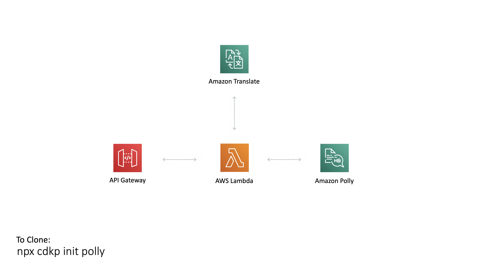

# Polly Pattern

This is a pattern that integrates the Amazon Polly service into an AWS Lambda Function so that you can translate text into speech using a serverless stack

Some Useful References:

| Author        | Link           |
| ------------- | ------------- |
| Amazon Polly | [Amazon Polly Site](https://aws.amazon.com/polly/) |
| Pricing | [Polly Pricing](https://aws.amazon.com/polly/pricing/) |
| Permissions | [Polly IAM Permissions](https://docs.aws.amazon.com/polly/latest/dg/api-permissions-reference.html) |
| AWS Blogs | [Giving your content a voice with the Newscaster speaking style from Amazon Polly](https://aws.amazon.com/blogs/machine-learning/giving-your-content-a-voice-with-the-newscaster-speaking-style-from-amazon-polly/) |
| Timothy Mugayi | [Text-to-Speech: Build Apps That Talk With AWS Polly and Node.js](https://medium.com/better-programming/text-to-speech-build-apps-that-talk-with-aws-polly-and-node-js-a9cdab99af04 ) |

