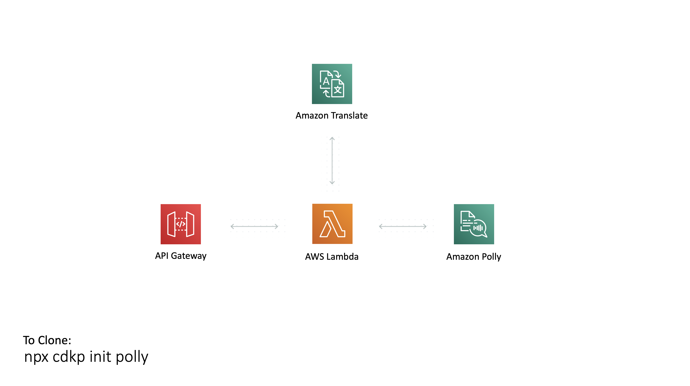

# Polly Pattern



This is a pattern that integrates the Amazon Polly service into an AWS Lambda Function so that you can synthesize text into speech using a serverless stack. It also integrates with Amazon Translate to allow you to choose the language for the spoken text.

Some Useful References:

| Author        | Link           |
| ------------- | ------------- |
| Amazon Polly | [Amazon Polly Site](https://aws.amazon.com/polly/) |
| Polly Pricing | [Polly Pricing](https://aws.amazon.com/polly/pricing/) |
| Polly Permissions | [Polly IAM Permissions](https://docs.aws.amazon.com/polly/latest/dg/api-permissions-reference.html) |
| Amazon Translate | [What Is Amazon Translate?](https://docs.aws.amazon.com/translate/latest/dg/what-is.html) |
| Translate Pricing | [Translate Pricing](https://aws.amazon.com/translate/pricing/) |
| AWS Blogs | [Giving your content a voice with the Newscaster speaking style from Amazon Polly](https://aws.amazon.com/blogs/machine-learning/giving-your-content-a-voice-with-the-newscaster-speaking-style-from-amazon-polly/) |
| AWS Docs | [Using Amazon Polly with Amazon Translate](https://docs.aws.amazon.com/translate/latest/dg/examples-polly.html) |
| Timothy Mugayi | [Text-to-Speech: Build Apps That Talk With AWS Polly and Node.js](https://medium.com/better-programming/text-to-speech-build-apps-that-talk-with-aws-polly-and-node-js-a9cdab99af04 ) |
| Philip Kiely | [Text-To-Speech With AWS (Part 1)](https://www.smashingmagazine.com/2019/08/text-to-speech-aws/) |

## What is Included In This Pattern?

After deployment you will have an API Gateway HTTP API configured where all traffic points to a Lambda Function that calls the Polly / Translate service.

### API Gateway HTTP API
This is setup with basic settings where all traffic is routed to our Lambda Function

### Lambda Function
Takes in whatever voice you want and whatever text you want, translates it to whatever language you want then sends it to the Polly service and returns an Audio stream

## Testing The Pattern

After deployment in the deploy logs you will see the url for the API Gateway.

If you open that URL in chrome it will play an audio recording saying &quot;To hear your own script, you need to include text in the message body of your restful request to the API Gateway&quot;

For examples of the voice clips produced checkout the mp3 files in the [recordings folder](recordings)

You can customise this message based on how you call the url:

### Changing the voice
You can pick from 3 voices "Matthew" (the default), "Joanna" or "Lupe". This is using the newsreader style of voice which AWS recently launched so it currently only supports these 3.

To change voices just add a query param onto your url like:

```
https://{api-url}/?voice=Lupe
https://{api-url}/?voice=Joanna
https://{api-url}/?voice=Matthew
```

### Changing the language spoken
This Lambda Function is integrated with Amazon Translate so you can have Polly speak a variety of languages

To have Lupe speak Spanish just add the translateTo query param

```
https://{api-url}/?voice=Lupe&translateTo=es
```

If the text you are translating is in a language other than english you can use the translateFrom parameter

To understand what languages are possible please refer to the [documentation](https://docs.aws.amazon.com/translate/latest/dg/what-is.html)

### Changing the text
If you use a tool like Postman to send text in the body of a POST request to the url it will use Polly to synthesize your text

## Useful CDK Commands

The `cdk.json` file tells the CDK Toolkit how to execute your app.

This project is set up like a standard Python project.  The initialization
process also creates a virtualenv within this project, stored under the .env
directory.  To create the virtualenv it assumes that there is a `python3`
(or `python` for Windows) executable in your path with access to the `venv`
package. If for any reason the automatic creation of the virtualenv fails,
you can create the virtualenv manually.

To manually create a virtualenv on MacOS and Linux:

```
$ python3 -m venv .env
```

After the init process completes and the virtualenv is created, you can use the following
step to activate your virtualenv.

```
$ source .env/bin/activate
```

If you are a Windows platform, you would activate the virtualenv like this:

```
% .env\Scripts\activate.bat
```

Once the virtualenv is activated, you can install the required dependencies.

```
$ pip install -r requirements.txt
```

At this point you can now synthesize the CloudFormation template for this code.

```
$ cdk synth
```

To add additional dependencies, for example other CDK libraries, just add
them to your `setup.py` file and rerun the `pip install -r requirements.txt`
command.

## Useful commands

 * `cdk ls`          list all stacks in the app
 * `cdk synth`       emits the synthesized CloudFormation template
 * `cdk deploy`      deploy this stack to your default AWS account/region
 * `cdk diff`        compare deployed stack with current state
 * `cdk docs`        open CDK documentation

Enjoy!
