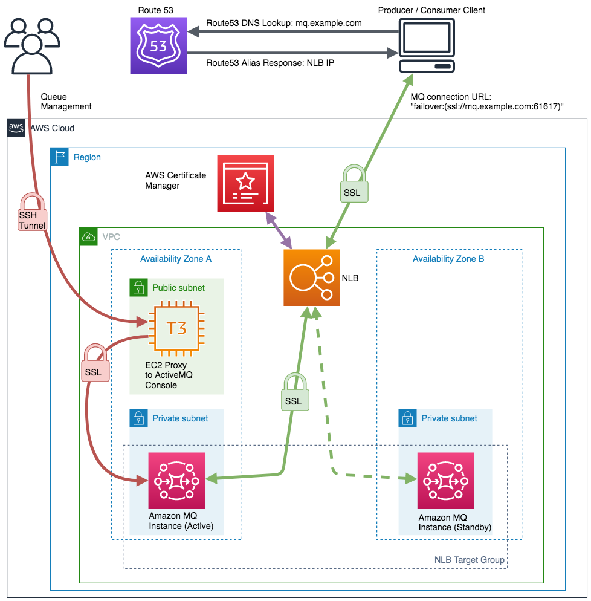

# The Basic MQ



This is an example cdk stack to deploy [static custom domain endpoints with Amazon MQ](https://aws.amazon.com/blogs/compute/creating-static-custom-domain-endpoints-with-amazon-mq/)  from Rachel Richardson.

In this example we have private Amazon MQ brokers behind an internet-facing network load balancer endpoint using a subdomain.

## Pre Requirements

This pattern requires you to have a Route53 Hosted Zone already in your account so that you can assign a public URL to your NLB.

After you setup a hosted zone, you can get the id from the console and replace the value for 'hostedZoneId' in the cdk stack. Then you need to replace 'zoneName' and 'subdomainName' with the url you desire in that hosted zone.

so if your hosted zone id is 1234 and you want your public url to be mq.cdkpatterns.com you would do:

```typescript
//Paste Hosted zone ID from Route53 console 'Hosted zone details'
export const hostedZoneId = '1234';

// If zoneName = 'cdkexample.com' and subdomainName = 'iot', you can connect to the broker by 'iot.cdkexample.com'.
export const zoneName = 'cdkpatterns.com';
export const subdomainName = 'mq';
```

After you have replaced these values from a console you can do:

```bash
npm run build && npm run deploy
```

## Testing broker connectivity

Once you deploy the stack, you can connect to the broker.
This time we will use [Amazon MQ workshop](https://github.com/aws-samples/amazon-mq-workshop) client application code from re:Invent 2018
to simplify connectivity test.

### Step 1. Create an environment in AWS Cloud9

Sign in to the AWS Cloud9 console and create an environment. You can leave settings as default.
After AWS Cloud9 creates your environment, you should see a bash shell window for the environment.

### Step 2. Set up client application

In the bash shell, clone the repo "amazon-mq-workshop" by running the following command:

```
git clone https://github.com/aws-samples/amazon-mq-workshop.git
```

Now the code is located on `~/environment/amazon-mq-workshop`. Next, type the following command one by one.

```
cd ~/environment/amazon-mq-workshop
./setup.sh
export temp_url="<failover url>"
echo "url=\"$temp_url\"" >> ~/.bashrc; source ~/.bashrc
```

By doing so you can tell the client application where to connect.
Make sure you replace with `<failover url>` something like `"failover:(ssl://mq.example.com:61617)"` 
(the NLB endpoint subdomain you defined in CDK stack).

### Step 3. Connect

Run the producer and consumer clients in separate terminal windows.
Run the following command to start the sender:

```
java -jar ./bin/amazon-mq-client.jar -url $url -mode sender -type queue -destination workshop.queueA -name Sender-1
```

Open the other terminal and run the following command to start the receiver:

```
java -jar ./bin/amazon-mq-client.jar -url $url -mode receiver -type queue -destination workshop.queueA
```

If the messages are sent and received successfully across the internet, a log output should be

(sender)

```
ec2-user:~/environment/amazon-mq-workshop (master) $ java -jar ./bin/amazon-mq-client.jar -url $url -mode sender -type queue -destination workshop.queueA -name Sender-1
[ActiveMQ Task-1] INFO org.apache.activemq.transport.failover.FailoverTransport - Successfully connected to ssl://mq.example.com:61617
22.08.2020 01:17:53.958 - Sender: sent '[queue://workshop.queueA] [Sender-1] Message number 1'
22.08.2020 01:17:54.975 - Sender: sent '[queue://workshop.queueA] [Sender-1] Message number 2'
22.08.2020 01:17:55.990 - Sender: sent '[queue://workshop.queueA] [Sender-1] Message number 3'
22.08.2020 01:17:57.8 - Sender: sent '[queue://workshop.queueA] [Sender-1] Message number 4'
22.08.2020 01:17:58.27 - Sender: sent '[queue://workshop.queueA] [Sender-1] Message number 5'
```

(receiver)

```
ec2-user:~/environment/amazon-mq-workshop (master) $ java -jar ./bin/amazon-mq-client.jar -url $url -mode receiver -type queue -destination workshop.queueA
[ActiveMQ Task-1] INFO org.apache.activemq.transport.failover.FailoverTransport - Successfully connected to ssl://mq.example.com:61617
22.08.2020 01:17:59.717 - Receiver: received '[queue://workshop.queueA] [Sender-1] Message number 1'
22.08.2020 01:17:59.718 - Receiver: received '[queue://workshop.queueA] [Sender-1] Message number 2'
22.08.2020 01:17:59.720 - Receiver: received '[queue://workshop.queueA] [Sender-1] Message number 3'
22.08.2020 01:17:59.721 - Receiver: received '[queue://workshop.queueA] [Sender-1] Message number 4'
22.08.2020 01:17:59.721 - Receiver: received '[queue://workshop.queueA] [Sender-1] Message number 5'
```

That's it. You can also check [Lab 4: Testing a Broker Fail-over](https://github.com/aws-samples/amazon-mq-workshop/blob/master/labs/lab-4.md)
to test this solution.

## Logging into the broker’s ActiveMQ console from a browser

Create a forwarding tunnel through an SSH connection to the bastion host.
First, you need to add a rule allowing SSH connection from your computer, to the security group which the bastion host belongs to (bastionToMQGroup).
You can retrieve bastionToMQGroup's security group ID and add the rule, and below is an example command in the terminal window.

```
SGID=`aws cloudformation describe-stacks --stack-name TheBasicMQStack --region us-east-1 --output json | \
jq -r '.Stacks[0].Outputs[] | select (.OutputKey == "bastionToMQGroupSGID").OutputValue'`
aws ec2 authorize-security-group-ingress --group-id ${SGID} --protocol tcp --port 22 --cidr YOUR-IP-ADDRESS/32
```
Next, push an SSH public key to the bastion host. The key is valid for 60 seconds.

```
InstanceID=`aws cloudformation describe-stacks --stack-name TheBasicMQStack --region us-east-1 --output json | \
jq -r '.Stacks[0].Outputs[] | select (.OutputKey == "bastionInstanceID").OutputValue'`
aws ec2-instance-connect send-ssh-public-key --instance-id ${InstanceID} --instance-os-user ec2-user --ssh-public-key 'file://~/.ssh/id_rsa.pub' --availability-zone us-east-1a
```

Finally, create a forwarding tunnel through an SSH connection to the bastion host.

```
InstancePublicDNS=`aws cloudformation describe-stacks --stack-name TheBasicMQStack --region us-east-1 --output json | \
jq -r '.Stacks[0].Outputs[] | select (.OutputKey == "bastionPublicDNS").OutputValue'`
ssh -D 8162 -N -i ~/.ssh/id_rsa ec2-user@${InstancePublicDNS}
```

Now you are ready to view broker’s ActiveMQ console from a browser. 
Open another window and run `aws mq describe-broker --broker-id myMQ` to get broker's endpoints.
Note only one broker host is active at a time.

If you use Firefox, go to Firefox Connection Settings.  
In the Configure Proxy Access to the Internet section, select Manual proxy configuration, 
then set the SOCKS Host to localhost and Port to 8162, leaving other fields empty.
(See "Creating a forwarding tunnel" [here](https://aws.amazon.com/blogs/compute/creating-static-custom-domain-endpoints-with-amazon-mq/).)

## Available Versions

 * [TypeScript](typescript/)
 * [Python](python/)
