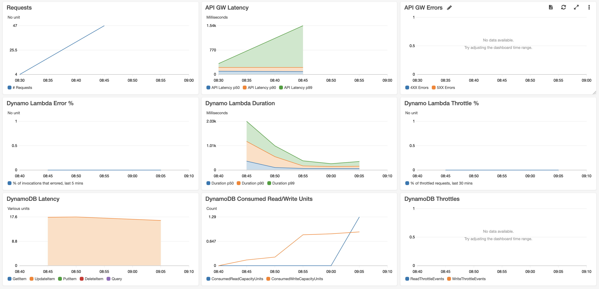
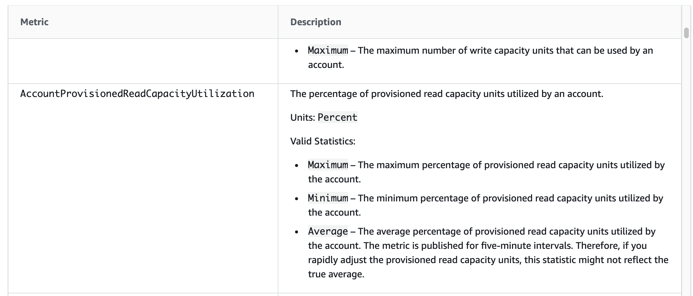

# The CloudWatch Dashboard



This is a project that has been configured with a well architected CloudWatch dashboard for the simple webservice stack (API Gateway HTTP API, Lambda Function and DynamoDB). It also includes multiple alerts which send messages to an SNS Topic.

Some useful References:


| Author        | Link           |
| ------------- | ------------- |
| AWS Docs | [CloudWatch Concepts](https://docs.aws.amazon.com/AmazonCloudWatch/latest/monitoring/cloudwatch_concepts.html) |
| Amazon Builders Library | [Building dashboards for operational visibility](https://aws.amazon.com/builders-library/building-dashboards-for-operational-visibility/) |
| Julian Wood     | [Understanding application health – part 1](https://aws.amazon.com/blogs/compute/building-well-architected-serverless-applications-understanding-application-health-part-1/)  |
| AWS GitHub | [Serverless Ecommerce Platform](https://github.com/aws-samples/aws-serverless-ecommerce-platform) | 
| AWS GitHub | [Real world Serverless Application](https://github.com/awslabs/realworld-serverless-application/wiki/Serverless-Operations) |
| AWS Docs    | [CloudWatch NameSpaces](https://docs.aws.amazon.com/AmazonCloudWatch/latest/monitoring/aws-services-cloudwatch-metrics.html)  |
| AWS Docs    | [Metric Math](https://docs.aws.amazon.com/AmazonCloudWatch/latest/monitoring/using-metric-math.html)  |
| AWS Docs    | [Lambda Metrics](https://docs.aws.amazon.com/lambda/latest/dg/monitoring-metrics.html)  |
| AWS Docs    | [DynamoDB Metrics](https://docs.aws.amazon.com/amazondynamodb/latest/developerguide/metrics-dimensions.html)  |
| AWS Docs    | [HTTP API Metrics](https://docs.aws.amazon.com/apigateway/latest/developerguide/http-api-metrics.html) and [REST API Metrics](https://docs.aws.amazon.com/apigateway/latest/developerguide/api-gateway-metrics-and-dimensions.html) |
| AWS WA | [Well Architected Docs](https://wa.aws.amazon.com/serv.question.OPS_1.en.html) |
| Yan Cui    | [Lambda Alerts](https://lumigo.io/blog/how-to-monitor-lambda-with-cloudwatch-metrics/) and [Logging Timeouts](https://theburningmonk.com/2019/05/how-to-log-timed-out-lambda-invocations/) |
| Yan Cui    | [Doing Better Than Percentiles](https://theburningmonk.com/2018/10/we-can-do-better-than-percentile-latencies/) |
| Blue Matador   | [Monitoring DynamoDB](https://www.bluematador.com/blog/how-to-monitor-amazon-dynamodb-with-cloudwatch) |
| DataDog   | [Top DynamoDB Performance Metrics](https://www.datadoghq.com/blog/top-dynamodb-performance-metrics/) |
| Abhaya Chauhan   | [DynamoDB: Monitoring Capacity and Throttling](https://www.abhayachauhan.com/2018/01/dynamodb-monitoring-capacity/) |

## Available Versions

* [TypeScript](typescript)
* [Python](python)


The [AWS Well-Architected](https://aws.amazon.com/architecture/well-architected/) Framework helps you understand the pros and cons of
decisions you make while building systems on AWS. By using the Framework, you will learn architectural best practices for designing and operating reliable, secure, efficient, and cost-effective systems in the cloud. It provides a way for you to consistently measure your architectures against best practices and identify areas for improvement.

We believe that having well-architected systems greatly increases the likelihood of business success.

[Serverless Lens Whitepaper](https://d1.awsstatic.com/whitepapers/architecture/AWS-Serverless-Applications-Lens.pdf) <br />
[Well Architected Whitepaper](http://d0.awsstatic.com/whitepapers/architecture/AWS_Well-Architected_Framework.pdf)

### The Operational Excellence Pillar

<strong>Note -</strong> The content for this section is a subset of the [Serverless Lens Whitepaper](https://d1.awsstatic.com/whitepapers/architecture/AWS-Serverless-Applications-Lens.pdf) with some minor tweaks.

The [operational excellence pillar](https://d1.awsstatic.com/whitepapers/architecture/AWS-Serverless-Applications-Lens.pdf#page=28) includes the ability to run and monitor systems to deliver business value and to continually improve supporting processes and procedures.

> OPS 1: How do you understand the health of your Serverless application?

#### Metrics and Alerts

It’s important to understand Amazon CloudWatch Metrics and Dimensions for every
AWS service you intend to use so that you can put a plan in a place to assess its
behavior and add custom metrics where you see fit.

Amazon CloudWatch provides automated cross service and per service dashboards to
help you understand key metrics for the AWS services that you use. For custom
metrics, use Amazon CloudWatch Embedded Metric Format to log a batch of metrics that will be processed asynchronously by CloudWatch without impacting the performance of your Serverless application.

The following guidelines can be used whether you are creating a dashboard or looking
to formulate a plan for new and existing applications when it comes to metrics:

<details>
    <summary>Business Metrics</summary>

    Business KPIs that will measure your application performance against
    business goals and are important to know when something is critically
    affecting your overall business, revenue wise or not

    Examples: Orders placed, debit/credit card operations, flights purchased etc.
</details>

<details>
    <summary>Customer Experience Metrics</summary>

    Customer experience data dictates not only the overall effectiveness of its
    UI/UX but also whether changes or anomalies are affecting customer
    experience in a particular section of your application. Often times, these are
    measured in percentiles to prevent outliers when trying to understand the
    impact over time and how it’s spread across your customer base.

    Examples: Perceived latency, time it takes to add an item to a basket or to
    check out, page load times, etc.
</details>

<details>
    <summary>System Metrics</summary>

    Vendor and application metrics are important to underpin root causes from
    the previous sections. They also tell you if your systems are healthy, at risk,
    or already your customers.

    Examples: Percentage of HTTP errors/success, memory utilization, function
    duration/error/throttling, queue length, stream records length, integration
    latency, etc.
</details>

<details>
    <summary>Operational Metrics</summary>

    Operational metrics are equally important to understand sustainability and
    maintenance of a given system and crucial to pinpoint how stability
    progressed/degraded over time.

    Examples: Number of tickets (successful and unsuccessful resolutions,
    etc.), number of times people on-call were paged, availability, CI/CD pipeline
    stats (successful/failed deployments, feedback time, cycle and lead time etc.)
</details>

CloudWatch Alarms should be configured at both individual and aggregated levels. An
individual-level example is alarming on the Duration metric from Lambda or
IntegrationLatency from API Gateway when invoked through API, since different parts of
the application likely have different profiles. In this instance, you can quickly identify a bad deployment that makes a function execute for much longer than usual. 


## What is Included In This Pattern?

I took one of the other cdk patterns (the simple webservice) and implemented a real well-architected CloudWatch dashboard which would be useful if you wanted to use the simple webservice in production.

I then added CloudWatch alarms which all post to an SNS topic.

The Simple Webservice:


The Dashboard:


The current Dashboard Widgets and Cloudwatch Alarms are:

### API Gateway

#### Widgets

- Number of Requests
- Latency
- 4xx and 5xx Errors

#### Alarms

- API Gateway 4XX Errors > 1%
- API Gateway 5XX Errors > 0
- API p99 latency alarm >= 1s

### Lambda

#### Widgets

- % of Lambda invocations that errored
- Lambda p50, p90 and p99 Duration
- % of Lambda invocations that are throttled

#### Alarms

- Dynamo Lambda 2% Error
- Dynamo Lambda p99 Long Duration (>1s)
- Dynamo Lambda 2% Throttled

### DynamoDB

#### Widgets

- Latency
- Consumed Read/Write Units
- DynamoDB Read/Write Throttle Events

#### Alarms

- DynamoDB Table Reads/Writes Throttled
- DynamoDB Errors > 0

## Testing This Pattern

After you deploy this pattern you will have an API Gateway with a proxy endpoint where any call will hit the dynamo lambda which inserts the path of the url you hit into DynamoDB.

CloudWatch from personal experience seems to run about 10-15 minutes behind real-time so unfortunately you cannot hit the API then immediately open the dashboard and watch the graphs change.

What you can do is deploy this stack and start changing pieces to break or react differently and see how many alerts you trigger or after waiting a few minutes see if it shows on the dashboards.

## Namespaces

If you want to use some of the out of the box metrics you need to know the namespace for that AWS Service e.g. 'AWS/DynamoDB'. You can mostly guess but for the complete list see [here](https://docs.aws.amazon.com/AmazonCloudWatch/latest/monitoring/aws-services-cloudwatch-metrics.html)

## Metric Math
[Official AWS Docs](https://docs.aws.amazon.com/AmazonCloudWatch/latest/monitoring/using-metric-math.html)

Something that is very powerful in CloudWatch is that you can write mathematical expressions based off existing metrics to create a new metric. I have done this several times to produce this dashboard:

```javascript
// Gather the % of lambda invocations that error in past 5 mins
let dynamoLambdaErrorPercentage = new cloudwatch.MathExpression({
    expression: 'e / i * 100',
    label: '% of invocations that errored, last 5 mins', 
    usingMetrics: {
        i: dynamoLambda.metric("Invocations", {statistic: 'sum'}),
        e: dynamoLambda.metric("Errors", {statistic: 'sum'}),
    },
    period: cdk.Duration.minutes(5)
});
```

You can see that we took the invocations metric and gave it a name "i" and the errors metric "e" then applied the formula "e / i * 100" to produce the % of invocations that errored.

## CloudWatch Metric Dimensions
[Official AWS Docs](https://docs.aws.amazon.com/AmazonCloudWatch/latest/monitoring/cloudwatch_concepts.html#Dimension)

This is a very important part of CloudWatch to understand. Every metric supports a range of dimensions which are listed in the AWS docs per metric per service:

- [Lambda Metrics](https://docs.aws.amazon.com/lambda/latest/dg/monitoring-metrics.html)  
- [DynamoDB Metrics](https://docs.aws.amazon.com/amazondynamodb/latest/developerguide/metrics-dimensions.html)  
- [HTTP API Metrics](https://docs.aws.amazon.com/apigateway/latest/developerguide/http-api-metrics.html)
- [REST API Metrics](https://docs.aws.amazon.com/apigateway/latest/developerguide/api-gateway-metrics-and-dimensions.html) 

These allow you to do things like deep dive into the DynamoDB query type or pick a specific lambda version

## CloudWatch Metric Statistics
[Official AWS Docs](https://docs.aws.amazon.com/AmazonCloudWatch/latest/monitoring/cloudwatch_concepts.html#Statistic)

This is another very important part of CloudWatch to understand. Every metric supports a range of statistics which are listed in the AWS docs per metric per service:

- [Lambda Metrics](https://docs.aws.amazon.com/lambda/latest/dg/monitoring-metrics.html)  
- [DynamoDB Metrics](https://docs.aws.amazon.com/amazondynamodb/latest/developerguide/metrics-dimensions.html)  
- [HTTP API Metrics](https://docs.aws.amazon.com/apigateway/latest/developerguide/http-api-metrics.html)
- [REST API Metrics](https://docs.aws.amazon.com/apigateway/latest/developerguide/api-gateway-metrics-and-dimensions.html) 

Take this example from DynamoDB, you can use Maximum, Minimum or Average for your statistic and they all provide you a different view on the data



There are also [percentile statistics](https://docs.aws.amazon.com/AmazonCloudWatch/latest/monitoring/cloudwatch_concepts.html#Percentiles)

```A percentile indicates the relative standing of a value in a dataset. For example, the 95th percentile means that 95 percent of the data is lower than this value and 5 percent of the data is higher than this value. Percentiles help you get a better understanding of the distribution of your metric data.```

## Useful commands

 * `npm run build`   compile typescript to js
 * `npm run watch`   watch for changes and compile
 * `npm run test`    perform the jest unit tests
 * `npm run deploy`      deploy this stack to your default AWS account/region
 * `cdk diff`        compare deployed stack with current state
 * `cdk synth`       emits the synthesized CloudFormation template
