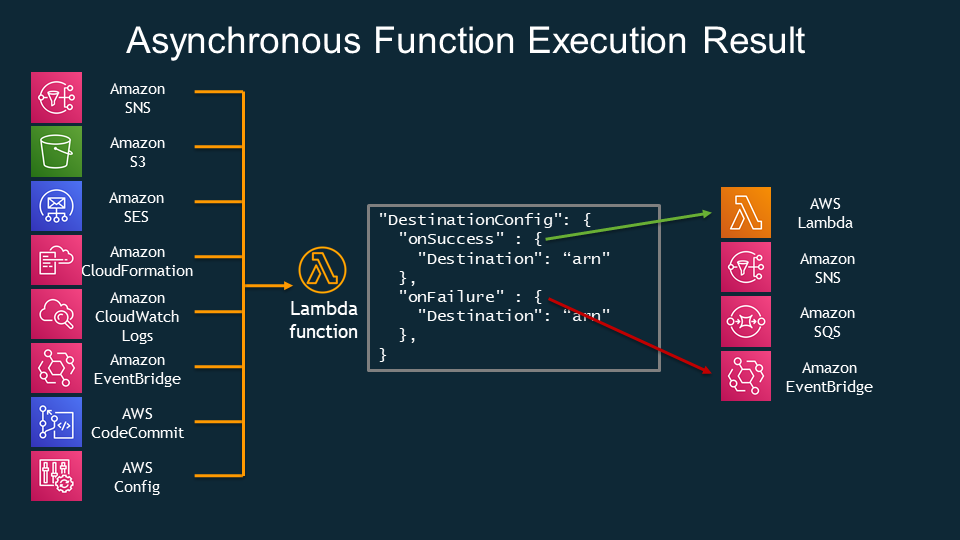

# The Destined Lambda

This project combines [Lambda Destinations](https://aws.amazon.com/blogs/compute/introducing-aws-lambda-destinations/) with [Amazon EventBridge](https://aws.amazon.com/eventbridge/) to show you that with EventBridge rules you can decouple your components in an event driven architecture and by combining it with lambda destinations you can strip out EventBridge specific code from your lambda functions themselves and decouple further.

An important point about Lambda Destinations is that they have to be executed asyncronously which is why the lambda is invoked via SNS in this pattern. To reduce custom code, I have integrated the SNS directly with API Gateway using Apache VTL.

## Architecture


At time of writing there are 4 available destinations targets but I have chosen EventBridge as to be honest this is the most complicated and powerful of the 4:



## When You Would Use This Pattern
If you are building an asyncronous, event driven flow but step functions seem too heavy weight for your current needs. 

Alternatively As illustrated in this implementation, you can use it to strip custom logic for sending events to EventBridge from your Lambdas

## How To Test Pattern
After you deploy this pattern you will have an API Gateway with one endpoint "SendEvent" that accepts GET requests.

To send a message that triggers the onSuccess flow just open the endpoint in a browser.

```https://{{API ID}}.execute-api.us-east-1.amazonaws.com/prod/SendEvent```

To send a message that triggers the onFailure flow add ?mode=fail onto the url.

```https://{{API ID}}.execute-api.us-east-1.amazonaws.com/prod/SendEvent?mode=fail```


## Useful commands

 * `npm run build`   compile typescript to js
 * `npm run watch`   watch for changes and compile
 * `npm run test`    perform the jest unit tests
 * `npm run deploy`      deploy this stack to your default AWS account/region
 * `cdk diff`        compare deployed stack with current state
 * `cdk synth`       emits the synthesized CloudFormation template
