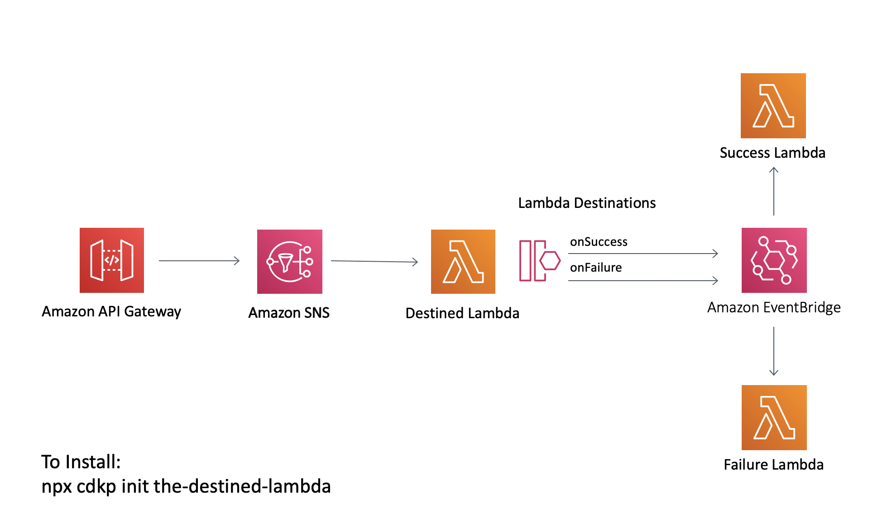

# The Destined Lambda

This project combines [Lambda Destinations](https://aws.amazon.com/blogs/compute/introducing-aws-lambda-destinations/) with [Amazon EventBridge](https://aws.amazon.com/eventbridge/) to show you that with EventBridge rules you can decouple your components in an event driven architecture and by combining it with lambda destinations you can strip out EventBridge specific code from your lambda functions themselves and decouple further.

An important point about Lambda Destinations is that they have to be executed asynchronously which is why the lambda is invoked via SNS in this pattern. To reduce custom code, I have integrated the SNS directly with API Gateway using [Apache VTL](https://velocity.apache.org/engine/1.7/vtl-reference.html).

## Architecture



### Architecture Notes

At time of writing there are 4 available destinations targets but I have chosen EventBridge as to be honest this is the most complicated and powerful of the 4:


The destined lambda sends some extra parameters in its response json. This is because we don't manually create the EventBridge envelope like normal so we need the ability to control how our events are processed:

```typescript
{
    source: 'cdkpatterns.the-destined-lambda',
    action: 'message',
    message: 'hello world'
}
```

by adding in the source and action fields this means that I could have multiple rules in eventbridge going to different targets based on the successful result of this function rather than the simple success/failure split you see today. 

```typescript
const successRule = new events.Rule(this, 'successRule', {
      eventBus: bus,
      description: 'all success events are caught here and logged centrally',
      eventPattern:
      {
        "detail": {
          "requestContext": {
            "condition": ["Success"]
          },
          "responsePayload": {
            "source": ["cdkpatterns.the-destined-lambda"],
            "action": ["message"]
          }
        }
      }
    });
```


For a complete version of routing flow based on the json payload see [The EventBridge ETL Pattern](https://github.com/cdk-patterns/serverless/tree/master/the-eventbridge-etl)


## When You Would Use This Pattern
If you are building an asyncronous, event driven flow but step functions seem too heavy weight for your current needs. 

Alternatively As illustrated in this implementation, you can use it to strip custom logic for sending events to EventBridge from your Lambdas

## Desconstructing The Destined Lambda
If you want a walkthrough of the theory, the code and finally a demo of the deployed implementation check out:
[](https://www.youtube.com/watch?v=DQgq_p6Q03M)

## How To Test Pattern
After you deploy this pattern you will have an API Gateway with one endpoint "SendEvent" that accepts GET requests.

You will get the base url for your deployed api from the deploy logs.

To send a message that triggers the onSuccess flow just open the endpoint in a browser.

```https://{{API ID}}.execute-api.us-east-1.amazonaws.com/prod/SendEvent```

To send a message that triggers the onFailure flow add ?mode=fail onto the url.

```https://{{API ID}}.execute-api.us-east-1.amazonaws.com/prod/SendEvent?mode=fail```

What you are looking for in both flows is inside the cloudwatch logs for the Success and Failure Lambda functions. You will see that in the logs for failure, not only do you get the actual error that was thrown but it also includes the event details that came into the function to cause the error. This means you have everything you need to replay it at your leisure.


## Useful commands

 * `npm run build`   compile typescript to js
 * `npm run watch`   watch for changes and compile
 * `npm run test`    perform the jest unit tests
 * `npm run deploy`      deploy this stack to your default AWS account/region
 * `cdk diff`        compare deployed stack with current state
 * `cdk synth`       emits the synthesized CloudFormation template
