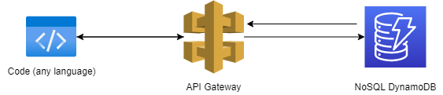
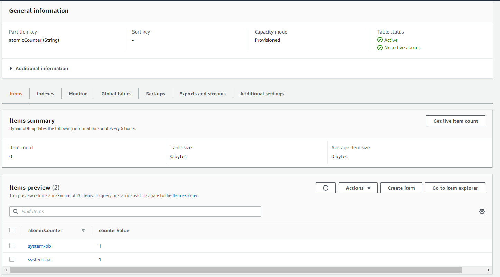

# The DynamoDB Atomic Counter



This is a Serverless pattern that implements an Atomic counter using only ApiGateway and DynamoDB. In many cases, we can use UUID to identify the key, but there are situations where we need an incremental and unique number due to software design or other needs. In this case, we must ensure that the number will be unique and won't be repeated, so this stack can solve this problem very cheaply. In addition, as this stack uses only DynamoDB and APIGateway, the response is very fast (in milliseconds).

A special thanks to Vikas Solegaonkar for sharing this link [Simple Atomic Counter with DynamoDB and API Gateway](https://itnext.io/simple-atomic-counter-with-dynamodb-and-api-gateway-e72115c209ff).  
I made changes to the original version to support multiple incremental keys, so you can use this to focus the incremental process for many systems on a single table and API.

Some Useful References:

| Author        | Link           |
| ------------- | ------------- |
| AWS Docs | [Increment an Atomic Counter](https://docs.amazonaws.cn/en_us/amazondynamodb/latest/developerguide/GettingStarted.NodeJs.03.html#GettingStarted.NodeJs.03.04) |
| A Cloud Guru | [DynamoDB Atomic Counters](https://acloudguru.com/blog/engineering/dynamodb-atomic-counters) |


## What's Included In This Pattern?
This pattern implements an atomic counter using only DynamoDB and APIGateway.

### DynamoDB Table
A simple table with a hash key and an incremental field

### API Gateway REST API
This is configured with the AWS Integration method and  Request/Response integrations to transform the data.

## How Do I Test This Pattern?

After deployment, the CDK will output a parameter like this:

```
TheDynamodbAtomicCounterStack.apigwcounterurl = https://q0nl7897m3.execute-api.us-east-1.amazonaws.com/prod/counter?systemKey=system-aa
```

So, just copy this URL and call this URL using the GET method through a browser, postman, curl or other http tool.

## Adding new keys to increment

If you want to add more keys to increment, it's very simple. Just use the DynamoDB console and add a new key.



After that, you can call the two urls and use different incremental urls:
```
https://q0nl7897m3.execute-api.us-east-1.amazonaws.com/prod/counter?systemKey=system-aa

https://q0nl7897m3.execute-api.us-east-1.amazonaws.com/prod/counter?systemKey=system-bb
```

## Performance and concurrency testing

API Response in less than 0.080s


Running the curl simultaneously on the same "dynamo key" and the numbers are not repeated


# Useful commands

* `dotnet build src` compile this app
* `cdk deploy`       deploy this stack to your default AWS account/region
* `cdk diff`         compare deployed stack with current state
* `cdk synth`        emits the synthesized CloudFormation template

## Deploy with AWS Cloud9

* Create an **Ubuntu** AWS Cloud9 EC2 development environment
* Add the Microsoft repository
    ```
    wget https://packages.microsoft.com/config/ubuntu/20.04/packages-microsoft-prod.deb -O packages-microsoft-prod.deb
    ```
    ```
    sudo dpkg -i packages-microsoft-prod.deb
    ```
* Install the .NET Core SDK
    ```
    sudo apt-get update; \
    sudo apt-get install -y apt-transport-https && \
    sudo apt-get update && \
    sudo apt-get install -y dotnet-sdk-3.1
    ```
* Clone the CDK Patterns repo
    ```
    git clone https://github.com/cdk-patterns/serverless.git
    ```
* Change directory
    ```
    cd serverless/the-scalable-webhook/csharp
    ```
* Build the project to see if .NET Core has been setup correctly (optional)
    ```
    dotnet build src
    ```
* Deploy the stack
    ```
    cdk deploy
    ```