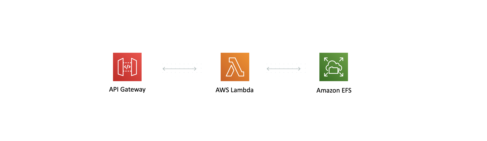

# The EFS Lambda Pattern

This is a pattern that attaches an EFS file system to your lambda function to give it expandable, persistent storage. Having this level of storage in a Lambda Function opens the door to many new possibilities (multiple functions can even use the same file system).

Some Useful References:

| Author        | Link           |
| ------------- | ------------- |
| AWS Docs | [Using Amazon EFS with Lambda](https://docs.aws.amazon.com/lambda/latest/dg/services-efs.html) |
| AWS Docs | [Configuring file system access for Lambda functions](https://docs.aws.amazon.com/lambda/latest/dg/configuration-filesystem.html) |
| AWS Samples | [EFS for Lambda - Example SAM applications](https://github.com/aws-samples/aws-lambda-efs-samples) |
| James Beswick | [Using Amazon EFS for AWS Lambda in your serverless applications](https://aws.amazon.com/blogs/compute/using-amazon-efs-for-aws-lambda-in-your-serverless-applications/) |
| Danilo Poccia | [A Shared File System for Your Lambda Functions](https://aws.amazon.com/blogs/aws/new-a-shared-file-system-for-your-lambda-functions/) |
| Yan Cui | [Unlocking New Serverless Use Caes With EFS and Lambda](https://lumigo.io/blog/unlocking-more-serverless-use-cases-with-efs-and-lambda/) |

## What's Included In This Pattern?
This pattern covers the first half of Danilo Poccia's awesome [blog post](https://aws.amazon.com/blogs/aws/new-a-shared-file-system-for-your-lambda-functions/). After deployment you will have an API Gateway HTTP API where any url you hit gets directed to a Lambda Function that is integrated with EFS.

### VPC
A VPC is bundled in this pattern because EFS requires it, this is using the default settings from CDK so if you want to put this in production you will have to review / refine this

### EFS FileSystem
A FileSystem is included in the above VPC with a removal policy of destroy. In a production system you probably would want to retain your storage on stack deletion.

POSIX permissions are also setup for this File System

### Lambda Function
A simple Python lambda function that interacts with the file system - storing, retrieving and deleting messages. This Lambda Function is taken directly from Danilo's blog post, if someone wants to contribute a Node version that would be awesome. Otherwise I will refactor over time to Node.

### API Gateway HTTP API
This is configured with the Lambda Function as the default handler for any url you hit.

## How Do I Test This Pattern?

Our deployed Lambda Function is acting as a shared message broker. It allows you to send messages to it which it stores in EFS, then you can retrieve all messages to read them or delete all messages after you have finished reading.

The Lambda Function will behave differently based on the RESTful verb you use:

- GET - Retrieve messages
- POST - Send a message (whatever you send in the body is the message)
- DELETE - Deletes all stored messages

The URL for the HTTP API to use these commands will be printed in the CloudFormation stack output after you deploy

Note - After deployment you may need to wait 60-90 seconds before the implementation works as expected. There are a lot of network configurations happening so you need to wait on propagation

## Useful commands

 * `npm run build`   compile typescript to js
 * `npm run watch`   watch for changes and compile
 * `npm run test`    perform the jest unit tests
 * `npm run deploy`      deploy this stack to your default AWS account/region
 * `cdk diff`        compare deployed stack with current state
 * `cdk synth`       emits the synthesized CloudFormation template
