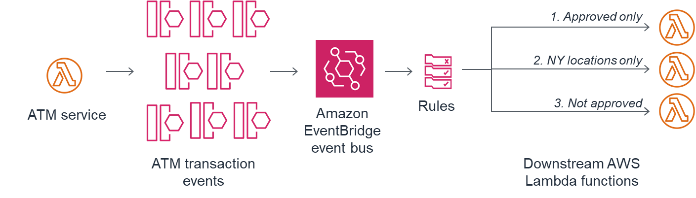

# The EventBridge ATM

This is an example CDK stack to deploy the code from this blogpost by [James Beswick](https://twitter.com/jbesw)- https://aws.amazon.com/blogs/compute/integrating-amazon-eventbridge-into-your-serverless-applications/

In this example, a banking application for automated teller machine (ATM) produces events about transactions. It sends the events to EventBridge, which then uses rules defined by the application to route accordingly. There are three downstream services consuming a subset of these events.



## When You Would Use This Pattern

EventBridge is an awesome centralised service for routing events between various consumers based on rules. You could set up an EventBridge within your domain and then accessing events within that domain is as easy as a rule in EventBridge, this significantly cuts down on the number of coupled interactions you have between your various services.

## How to test pattern 

After deployment you will have an api gateway where hitting any endpoint triggers the events to be sent to EventBridge defined in lambdas/atmProducer/events.js

* All Approved transactions go to consumer 1
* NY Transactions go to consumer 2
* Declined transactions go to consumer 3

## Useful CDK Commands

The `cdk.json` file tells the CDK Toolkit how to execute your app.

This project is set up like a standard Python project.  The initialization
process also creates a virtualenv within this project, stored under the .env
directory.  To create the virtualenv it assumes that there is a `python3`
(or `python` for Windows) executable in your path with access to the `venv`
package. If for any reason the automatic creation of the virtualenv fails,
you can create the virtualenv manually.

To manually create a virtualenv on MacOS and Linux:

```
$ python -m venv .env
```

After the init process completes and the virtualenv is created, you can use the following
step to activate your virtualenv.

```
$ source .env/bin/activate
```

If you are a Windows platform, you would activate the virtualenv like this:

```
% .env\Scripts\activate.bat
```

Once the virtualenv is activated, you can install the required dependencies.

```
$ pip install -r requirements.txt
```

At this point you can now synthesize the CloudFormation template for this code.

```
$ cdk synth
```

To add additional dependencies, for example other CDK libraries, just add
them to your `setup.py` file and rerun the `pip install -r requirements.txt`
command.

## Useful commands

 * `cdk ls`          list all stacks in the app
 * `cdk synth`       emits the synthesized CloudFormation template
 * `cdk deploy`      deploy this stack to your default AWS account/region
 * `cdk diff`        compare deployed stack with current state
 * `cdk docs`        open CDK documentation

Enjoy!
