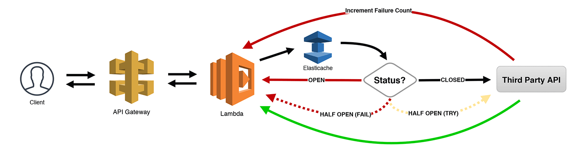
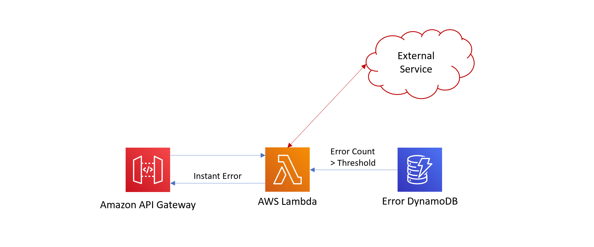

# The EventBridge Circuit Breaker

This is an example CDK stack to deploy an interpretation of The Circuit Breaker stack described by Jeremy Daly here - https://www.jeremydaly.com/serverless-microservice-patterns-for-aws/#circuitbreaker and by [Martin Fowler](https://twitter.com/martinfowler) all the way back in 2014 [here](https://martinfowler.com/bliki/CircuitBreaker.html)

In this example, we have a lambda behind an API gateway that is supposed to integrate with an external webservice (www.google.com). The problem is that Google is down and it takes 10 seconds for your lambda to return that error. You pay for every ms of execution with Lambda so this is bad if lots of consumers hit your service.

Don't worry, we have integrated a circuit breaker into this system. When a call to google fails an error event is pushed to EventBridge where it is routed to a lambda that inserts a record into DynamoDB with a 60 second lifespan.

When a consumer calls our lambda we check if there have been 3 failure events in the last 60 seconds and if so we fail immediately, this saves over 9 seconds of execution costs. As the error events expire after 60 seconds our failure events should gradually drop below 3 where we call the service again and check status.

### Jeremy Daly's Pattern:


### Closed Circuit Architecture:
The lambda queries the dynamoDB for errors added in the last 60 seconds for this service. If the number found is greater than our threshold we open the circuit. If the number is less we close the circuit and try calling the service. If an error occurs during that call an event is sent to EventBridge where it is routed to a lambda that inserts an error into DynamoDB with a 60 second TTL


### Open Circuit Architecture:
The lambda queries the dynamoDB for errors added in the last 60 seconds for this service. In this scenario the number found is greater than our threshold so the lambda immediately responds with a failure rather than calling the real service.


## When You Would Use This Pattern

When integrating with an external webservice via a lambda that is not stable. This will save you execution costs, it will also improve end user experience because not only are they still receiving an error without this but they have to wait the full 10 seconds for it.

## How to test pattern 

After deployment you will have an api gateway where hitting any endpoint calls our fake unstable google endpoint. The first 3 times you hit the endpoint should all take 10 seconds each, then the next should be instant with a message saying the circuit was closed. 

Now wait 60 seconds and try again, you should see the 10 second wait return

## Useful CDK Commands

The `cdk.json` file tells the CDK Toolkit how to execute your app.

This project is set up like a standard Python project.  The initialization
process also creates a virtualenv within this project, stored under the .env
directory.  To create the virtualenv it assumes that there is a `python3`
(or `python` for Windows) executable in your path with access to the `venv`
package. If for any reason the automatic creation of the virtualenv fails,
you can create the virtualenv manually.

To manually create a virtualenv on MacOS and Linux:

```
$ python -m venv .env
```

After the init process completes and the virtualenv is created, you can use the following
step to activate your virtualenv.

```
$ source .env/bin/activate
```

If you are a Windows platform, you would activate the virtualenv like this:

```
% .env\Scripts\activate.bat
```

Once the virtualenv is activated, you can install the required dependencies.

```
$ pip install -r requirements.txt
```

At this point you can now synthesize the CloudFormation template for this code.

```
$ cdk synth
```

To add additional dependencies, for example other CDK libraries, just add
them to your `setup.py` file and rerun the `pip install -r requirements.txt`
command.

## Useful commands

 * `cdk ls`          list all stacks in the app
 * `cdk synth`       emits the synthesized CloudFormation template
 * `cdk deploy`      deploy this stack to your default AWS account/region
 * `cdk diff`        compare deployed stack with current state
 * `cdk docs`        open CDK documentation

Enjoy!
