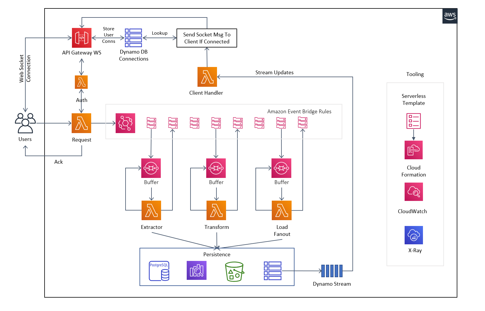

# The EventBridge ETL

This is an example stack showing how you can use EventBridge to orchestrate events through an ETL process.

### Architecture:

## Pattern Source

This pattern was insired by two people:

## Vyas Sarangapani
Twitter - [link](https://twitter.com/madladvyas)
Article on [medium](https://medium.com/@svyasrao22/how-to-build-a-scalable-cost-effective-event-driven-etl-solution-using-serverless-b407c14d4093)

### His Architecture

## When You Would Use This Pattern

If you need to create a process where a user uploads a csv and it gets transformed and inserted into DynamoDB

## How to test pattern 

After deployment you will have an s3 bucket where if you go into the aws console for that bucket and upload the file "test_data.csv" found in the data-to-upload folder.

After you upload that file to your bucket the process kicks off. You should be able to watch the process by looking in the cloudwatch logs for your observer lambda.

Finally all of the data ends up in your DynamoDB table so you should be able to open it in the console and view the data after transform.

## Available Versions

 * [TypeScript](typescript/)
 * [Python](python/)
