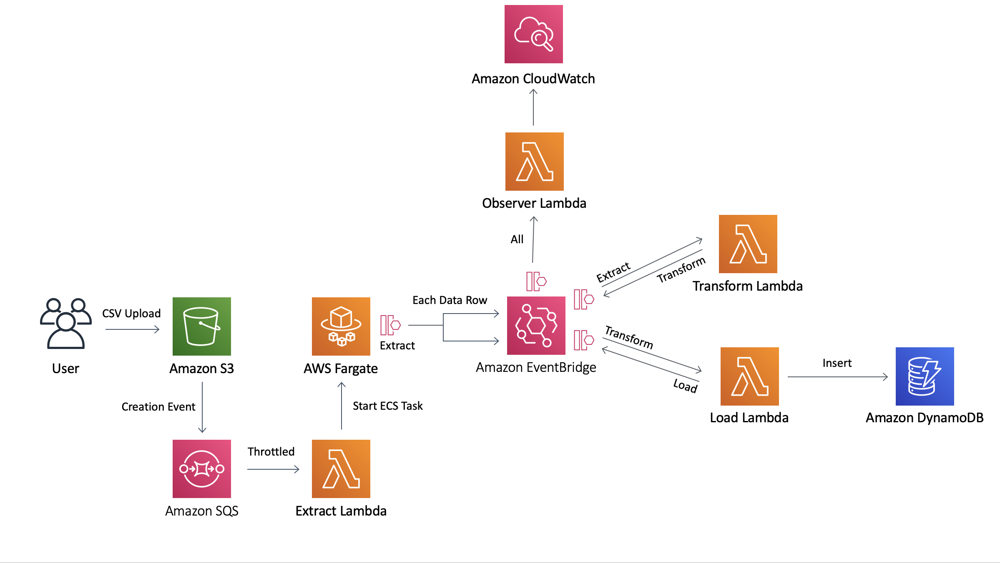
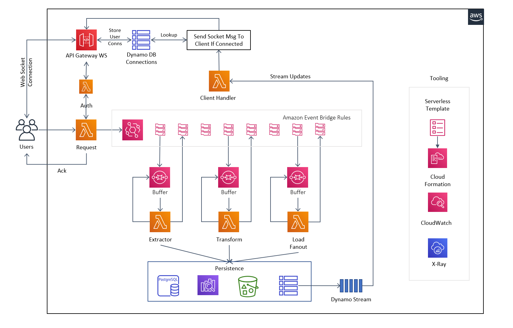
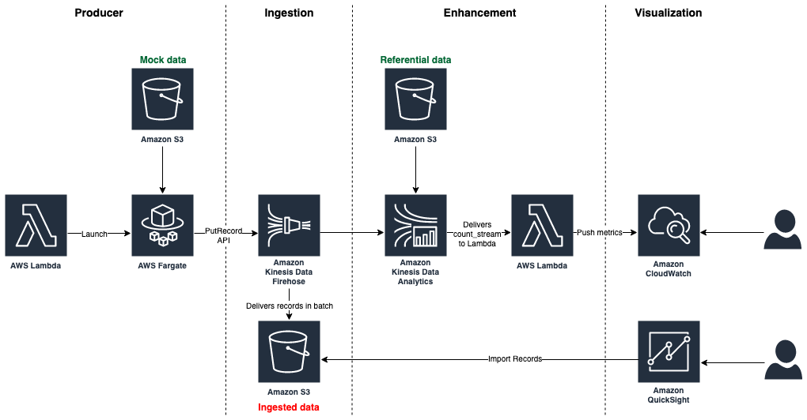

# The EventBridge ETL

This is an example stack showing how you can use EventBridge to orchestrate events through an ETL process. This pattern was insired by [Vyas Sarangapani](https://twitter.com/madladvyas) and [Hervé Nivon](https://twitter.com/hervenivon) as you can see at the bottom of this page.

Note - This is a learning pattern, if I was implementing this in a production system I would make a couple of changes:

* KMS Encryption of sensitive data in events
* SQS between EventBridge and the Lambdas for resiliency
* Add in error events to EventBridge and error event rules

### Architecture:

#### Architecture Notes

##### Fargate ECS Task
I chose to use a Fargate container to download the file from s3 rather than using Lambda. For the small bundled test data csv Lambda would have worked but I felt it would be misleading and suggestive that you could pull larger files down onto a Lambda function. Lambda functions have a few limitations around memory, storage and runtime. You can do things like partially stream files from s3 to Lambda (if they happen to be in the right format) and then store state somewhere between timeouts but I felt that having an ECS Task that you can define CPU, RAM and Disk Space was the much more flexible way to go and being Fargate you are still on the serverless spectrum. You can see how cheap Fargate is if you go into the cost breakdown in Hervé's GitHub repo.

##### Throttling The Lambda Functions
Without throttling, if you put every row in a huge csv file onto EventBridge with a subscriber lambda; That lambda can scale up until it uses all the concurrency on your account. This may be what you want (probably not though). That is why I limited all the concurrency of the lambdas, you can remove this limit or tweak as much as you want but you always need to think about what else is running in that account. Isolate your stack into its own account if possible.

##### Observer Lambda
In the current format this is more of a technical demo to show what is possible with event driven architectures. Everything that it logs is already in the logs of all the individual components. You could probably use this to keep a tally for every record that gets pulled from the csv to make sure it gets inserted into DynamoDB by pulling the ids from the extraction and load events.

## When You Would Use This Pattern

If you need to create a process where a user uploads a csv and it gets transformed and inserted into DynamoDB

## Desconstructing The EventBridge ETL
If you want a walkthrough of the theory, the code and finally a demo of the deployed implementation check out:

## How to test pattern 

After deployment you will have an s3 bucket where if you go into the aws console for that bucket and upload the file [test_data.csv](data-to-upload/test_data.csv) found in the data-to-upload folder you will kick everything off.

After you upload that file everything should automatically start working. You should be able to watch the process by looking in the cloudwatch logs for your observer lambda. Note this is a multi-threaded, concurrent process so the order of the events in the observer logs may not be what you were expecting!

Finally all of the data ends up in your DynamoDB table so you should be able to open it in the console and view the data after transform.

## Useful commands

 * `npm run build`   compile typescript to js
 * `npm run watch`   watch for changes and compile
 * `npm run test`    perform the jest unit tests
 * `npm run deploy`  deploy this stack to your default AWS account/region
 * `cdk diff`        compare deployed stack with current state
 * `cdk synth`       emits the synthesized CloudFormation template

## Pattern Origins

This pattern was insired by two people:

### Vyas Sarangapani
Twitter - [link](https://twitter.com/madladvyas)  
Full Article explaining architecture on [medium](https://medium.com/@svyasrao22/how-to-build-a-scalable-cost-effective-event-driven-etl-solution-using-serverless-b407c14d4093)

#### Architecture

### Hervé Nivon
Twitter - [link](https://twitter.com/hervenivon)  
Github - [repo](https://github.com/hervenivon/aws-experiments-data-ingestion-and-analytics)

#### Architecture
