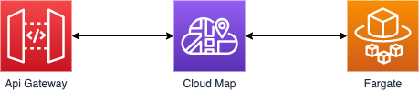

# The Fargateway

This is an example CDK stack to run a Fargate service behind an API Gateway. It uses CloudMap for service discovery and does not need a Load Balancer. It's based on this blog post - https://aws.amazon.com/blogs/architecture/field-notes-serverless-container-based-apis-with-amazon-ecs-and-amazon-api-gateway/

## When You Would Use This Pattern

This patterns allows an Fargate service to leaverage the capabilities provided by API Gateway (e.g. import/export of OpenAPI defintions, throttling, authorization).

An advantage compared to [load balanced Fargate service](https://docs.aws.amazon.com/cdk/api/latest/docs/aws-ecs-patterns-readme.html#application-load-balanced-services) are lower costs. In Api Gateway 1 million requests per month costs around $1 whereas an ALB costs around $16 per month.

## How to test pattern

After deployment you will have an api gateway where the nginx Fargate service is served.

## Available Versions

- [TypeScript](typescript/)
