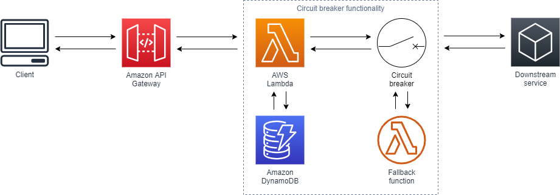

# The Lambda Circuit Breaker



This is a pattern that I found via [Gunnar Grosch](https://twitter.com/GunnarGrosch) and his open source circuit breaker on  [GitHub](https://github.com/gunnargrosch/circuitbreaker-lambda). This is a different implementation to solve the same problem as the eventbridge circuit breaker pattern.

Some Useful References:

| Author        | Link           |
| ------------- | ------------- |
| Martin Fowler      | [Blog Post (2014)](https://martinfowler.com/bliki/CircuitBreaker.html) |
| Jeremy Daly | [Blog Post](https://www.jeremydaly.com/serverless-microservice-patterns-for-aws/#circuitbreaker) |
| Mark Michon | [Blog Post](https://blog.bearer.sh/build-a-circuit-breaker-in-node-js/) |
| Gunnar Grosch | [GitHub](https://github.com/gunnargrosch/circuitbreaker-lambda) |


The [AWS Well-Architected](https://aws.amazon.com/architecture/well-architected/) Framework helps you understand the pros and cons of
decisions you make while building systems on AWS. By using the Framework, you will learn architectural best practices for designing and operating reliable, secure, efficient, and cost-effective systems in the cloud. It provides a way for you to consistently measure your architectures against best practices and identify areas for improvement.

We believe that having well-architected systems greatly increases the likelihood of business success.

[Serverless Lens Whitepaper](https://d1.awsstatic.com/whitepapers/architecture/AWS-Serverless-Applications-Lens.pdf) <br />
[Well Architected Whitepaper](http://d0.awsstatic.com/whitepapers/architecture/AWS_Well-Architected_Framework.pdf)

### The Reliability Pillar

<strong>Note -</strong> The content for this section is a subset of the [Serverless Lens Whitepaper](https://d1.awsstatic.com/whitepapers/architecture/AWS-Serverless-Applications-Lens.pdf) with some minor tweaks.

The [reliability pillar](https://d1.awsstatic.com/whitepapers/architecture/AWS-Serverless-Applications-Lens.pdf#page=48) includes the ability of a system to recover from infrastructure or service disruptions, dynamically acquire computing resources to meet demand, and mitigate disruptions such as misconfigurations or transient network issues.

> REL 2: How are you building resiliency into your serverless application?

Evaluate scaling mechanisms for Serverless and non-Serverless resources to meet customer demand, and build resiliency to withstand partial and intermittent failures across dependencies.

Best Practices:

1 / Manage transaction, partial, and intermittent failures: Transaction failures might occur when components are under high load. Partial failures can occur during batch processing, while intermittent failures might occur due to network or other transient issues.

## What's Included In This Pattern?

This is an implementation of the simple webservice pattern only instead of our Lambda Function using DynamoDB to store and retrieve data for the user it is being used to tell our Lambda Function if the webservice it wants to call is reliable right now or if it should use a fallback function.

To demonstrate this behaviour the Lambda function has some logic in it to simulate failure. The below logic will randomly fail:

```typescript
function unreliableFunction () {
  return new Promise((resolve, reject) => {
    if (Math.random() < 0.6) {
      resolve({ data: 'Success' })
      message = 'Success'
    } else {
      reject({ data: 'Failed' })
      message = 'Failed'
    }
  })
}
```

Then we have a circuitbreaker configured with a fallback mechanism for when it has failed too many times recently:

```typescript
function fallbackFunction () {
  return new Promise((resolve, reject) => {
    resolve({ data: 'Expensive Fallback Successful' })
    message = 'Fallback'
  })
}

const options = {
  fallback: fallbackFunction,
  failureThreshold: 3,
  successThreshold: 2,
  timeout: 10000
}

exports.handler = async (event:any) => {
  const circuitBreaker = new CircuitBreaker(unreliableFunction, options)
  await circuitBreaker.fire()
  const response = {
    statusCode: 200,
    body: JSON.stringify({
      message: message
    })
  }
  return response
}
```

## When You Would Use This Pattern

When integrating with an external service and you want to provide a cost effective, resilient service for your consumers. If you don't do this and the external service is down you will be paying lambda invocation costs for the full request timeout plus your consumers will be waiting for an ultimately frustrating experience.

## How To Test This Pattern

After you deploy this pattern you will have a url for an API Gateway where if you open it in a browser you will get a JSON payload back with one of two messages:

```json
// when the circuit is closed and the unreliable function worked
{
   "message": "Success"
}
// when the circuit is open
{
   "message": "Fallback"
}
```
So refresh the browser a few times and you will see the message switch to Fallback then if you open the CloudWatch logs for your Lambda Function as you hit it again you should be able to watch the circuit breaker change state

You will see messages like:

- INFO CircuitBreaker state: OPEN
- INFO CircuitBreaker state: HALF
- INFO CircuitBreaker state: CLOSED

Open means that no requests are going through to the unreliable function, half means that some requests are let through to test the stability of the unreliable function and closed means operating as normal.


## Useful commands

 * `npm run build`   compile typescript to js
 * `npm run watch`   watch for changes and compile
 * `npm run test`    perform the jest unit tests
 * `npm run deploy`      deploy this stack to your default AWS account/region
 * `cdk diff`        compare deployed stack with current state
 * `cdk synth`       emits the synthesized CloudFormation template
