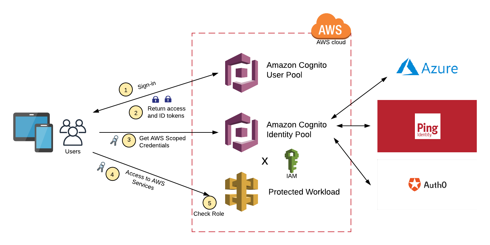

# The LAMBDA-OF-LEAST-PRIVILEGE implemented with an RBAC pattern

This is a pattern that aims to satisfy an application or standard needing to implement an service that implements RBAC leveraging Cognito Identity Pools and your external IDP (Such as Azure, Auth0 or Ping).

## What is Role-Based-Access-Control

Role-based access control (RBAC) is an idea of assigning permissions to users based on their role within an orgnaisation. It offers a simple, manageable approach to access management that is less prone to error than assigning permissions to users individually.

When using RBAC, you analyze the system needs of your users and group them into roles based on common responsibilities and needs. You then assign one or more roles to each user and one or more permissions to each role. The user-role and role-permissions relationships make it simple to perform user assignments since users no longer need to be managed individually, but instead have privileges that conform to the permissions assigned to their role(s).

When planning your access control strategy, it's best practice to assign users the fewest number of permissions that allow them to get their work done. Adopting a security principle of least privilege.

##  So what does this Pattern give us?

## Setup Instructions
//TODO Michael to add the meat here.
### Assemble your Client Application
Here is one that I made earlier. TODO add steps for VUE application

### Setup your IDP
Follow the following instructions and set yourself up your IDP.

### Plug your IDP Credentials into the Stack Configuration
Setup your IDP as a SAML based Auth Provider

### Deploy your Stack
You should now have the configuration for your Cognito Identity and User Pool

## Update your sweet Client Application with your Cognito Credentials
We are going to leverage Amplify to fire this ship up and begin logging in at taking our RBAC.

After deployment you should have a proxy api gateway where any url hits a lambda which inserts a record of the url into a dynamodb with a count of how many times that url has been visited.  This API Gateway will be protected by an IAM role. In order to invoke this API Gateway you will need to provide it an auth token. Cognito Identity Pool will be stood up and you will be able to retreive your auth token from there.

## Useful commands

 * `npm run build`   compile typescript to js
 * `npm run watch`   watch for changes and compile
 * `npm run test`    perform the jest unit tests
 * `npm run deploy`  deploy this stack to your default AWS account/region
 * `cdk diff`        compare deployed stack with current state
 * `cdk synth`       emits the synthesized CloudFormation template

 ### Cognito Resources
- [Lots of my code was inspired/borrowed from here](https://github.com/aws-samples/amazon-cognito-example-for-external-idp/blob/master/cdk/src/cdk.ts)
- [Identity Pools versus User Pools](https://serverless-stack.com/chapters/cognito-user-pool-vs-identity-pool.html)
- [Cognito Identity Pool Workshop](https://serverless-stack.com/chapters/configure-cognito-identity-pool-in-cdk.html) 
- [Cognito Userpool Auth](https://stackoverflow.com/questions/55784746/how-to-create-cognito-identitypool-with-cognito-userpool-as-one-of-the-authentic)
- [Cognito Identity Pool Tutorial for Google](https://medium.com/faun/cognito-idp-google-tutorial-379fa08464) 
- [Understanding Userpool Grants](https://aws.amazon.com/blogs/mobile/understanding-amazon-cognito-user-pool-oauth-2-0-grants/)

### RBAC Resources
- [CSRC RBAC](https://csrc.nist.gov/CSRC/media/Presentations/Role-based-Access-Control/images-media/Role-based%20Access%20Control2.pdf) 
- [RBAC Introduction](https://docs.aws.amazon.com/IAM/latest/UserGuide/introduction_attribute-based-access-control.html)
- [RBAC Wiki](https://en.wikipedia.org/wiki/Role-based_access_control)
- [RBAC at AWS](https://docs.amazonaws.cn/en_us/cognito/latest/developerguide/role-based-access-control.html)
- [RBAC v ABAC](https://www.dnsstuff.com/rbac-vs-abac-access-control)
