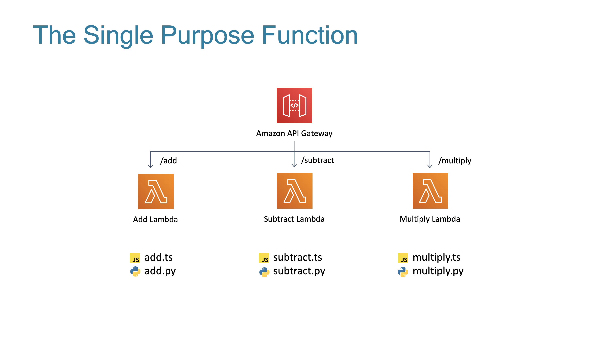

# The Lambda Trilogy

The three states of AWS Lambda are something that has been discussed by many serverless heroes since their invention.

Some examples from Paul Swail, Yan Cui and Jeremy Daly:
- [Serverless Chats](https://www.serverlesschats.com/41)
- [Off By None](https://www.jeremydaly.com/newsletter-issue-63/)
- [Yan Cui Presentation (slide 41 on)](https://www.slideshare.net/theburningmonk/beware-the-potholes-on-the-road-to-serverless-224107000)

The `cdk.json` file tells the CDK Toolkit how to execute your app.

## Useful commands

 * `npm run build`   compile typescript to js
 * `npm run watch`   watch for changes and compile
 * `npm run test`    perform the jest unit tests
 * `cdk deploy`      deploy this stack to your default AWS account/region
 * `cdk diff`        compare deployed stack with current state
 * `cdk synth`       emits the synthesized CloudFormation template
