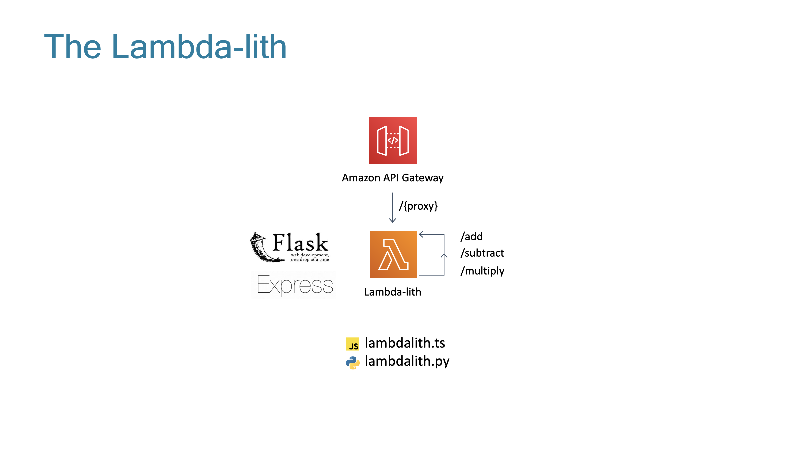

# The Lambda Trilogy

The three states of AWS Lambda are something that has been discussed by many serverless heroes since their invention.

Some examples from [Paul Swail](https://twitter.com/paulswail), [Yan Cui](https://twitter.com/theburningmonk) and [Jeremy Daly](https://twitter.com/jeremy_daly):
- [Serverless Chats](https://www.serverlesschats.com/41)
- [Off By None](https://www.jeremydaly.com/newsletter-issue-63/)
- [Yan Cui Presentation (slide 41 on)](https://www.slideshare.net/theburningmonk/beware-the-potholes-on-the-road-to-serverless-224107000)

The three states are:

### Description
This is the purest of all the serverless patterns. Each lambda does one unique function and the code is in its own file.

### Pros
- Maximum code reusability
- Forces you to write more testable code
- Lowest cognitive burden for developers working on that individual function
- Easier to optimize your lambda execution times and by extension costs

### Cons
- Only works for fully event driven architectures
- Seeing the bigger picture, congnitive burden increases as system wide changes are talked about
- Maintenance as it grows (how do you make sure 7000 lambdas have no code vulnerabilities?)

### Description
This is a compromise option where we can still have individual lambdas but we group the actual code together in one (or more) files. You would decide what goes into a file based on low coupling, high cohesion arguments like in traditional development.

### Pros
- Related logic is grouped together making your code easier to see the bigger picture
- Code can easily be shared between lambda functions without needing things like layers
- Security footprint reduced as updating one file can update many lambda functions

### Cons
- How big is too big? Every extra byte of code added slows your lambda cold start times.
- Increased blast radius of changes. Now one line of code being changed could bring down a section of your infrastructure instead of one lambda.

### Description
This is using the lambda runtime container like a docker container. You use a web framework like Flask or Express and put them inside the lambda, then have your api gateway pass all requests through to the lambda and have that framework process the request.

### Pros
- You can have an identical local development experience to deployed since you are using no AWS specific features
- The code could be moved to Fargate later if it got too big for lambda with minimal changes (or another cloud)
- Developers already know these frameworks

### Cons
- Is this really what Lambda excels at? The larger project sizes will increase cold start times and there will be restrictions on incoming/outgoing payload sizes
- Higher exposure to cold starts as the lambda will spend longer processing events
- Lower levels of code reuse as probably still building the traditional ball of mud
- Adapters required to make existing frameworks work with lambda. These are in various states of maturity and are another potential vulnerability in your app.

## Available Versions

 * [TypeScript](typescript/)
 * [Python](python/)