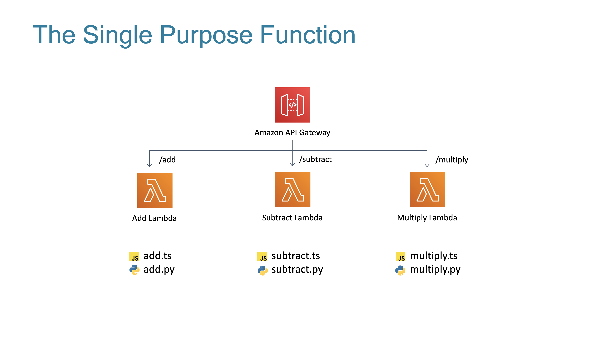
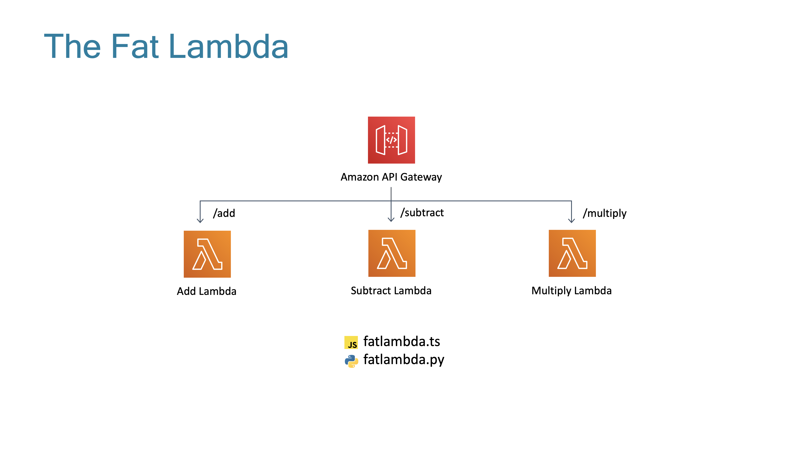
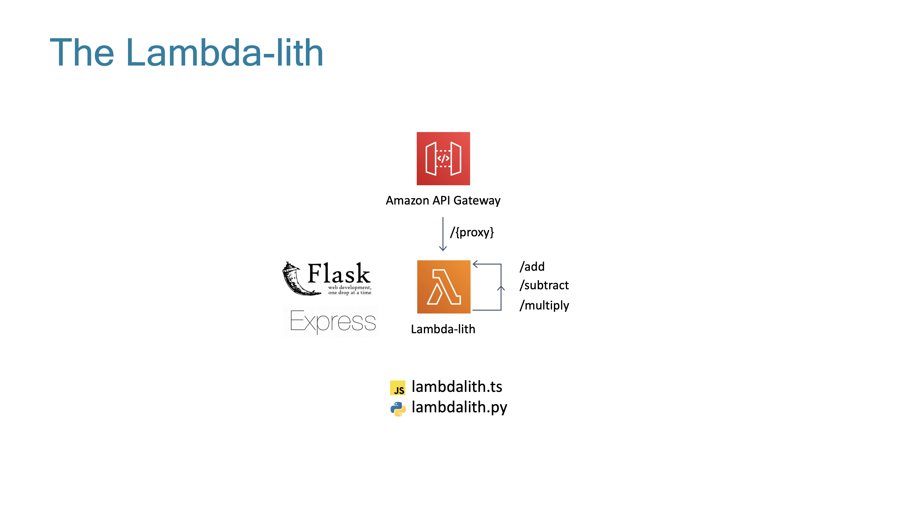

# The Lambda Trilogy

> Note, to deploy this pattern youself there is some extra setup which is listed in the extra setup section towards the bottom of this file.

The three states of AWS Lambda are something that has been discussed by many serverless heroes since their invention. This is probably the most controversial subject in all of serverless so I am not going to tell you which of the three is the best because like everything you need to adapt the right implementation to fit your context!

Some examples from [Paul Swail](https://twitter.com/paulswail), [Yan Cui](https://twitter.com/theburningmonk) and [Jeremy Daly](https://twitter.com/jeremy_daly):
- [Serverless Chats](https://www.serverlesschats.com/41)
- [Off By None](https://www.jeremydaly.com/newsletter-issue-63/)
- [Yan Cui Presentation (slide 41 on)](https://www.slideshare.net/theburningmonk/beware-the-potholes-on-the-road-to-serverless-224107000)

The three states are:



### Description
This is the purest of all the serverless patterns. Each lambda does one unique function and the code is in its own file.

### Pros
- Maximum code reusability
- Forces you to write more testable code
- Introduces lowest cognitive burden for developers making changes to that individual function
- Easier to optimize your lambda execution times and by extension costs

### Cons
- Only works for fully event driven architectures
- Seeing the bigger picture, congnitive burden increases as system wide changes are talked about
- Maintenance as it grows (how do you make sure 7000 lambdas have no code vulnerabilities?)



### Description
This is a compromise option where we can still have individual lambdas but we group the actual code together in one (or more) files. You would decide what goes into a file based on low coupling, high cohesion arguments like in traditional development.

### Pros
- Related logic is grouped together making your code easier to see the bigger picture
- Code can easily be shared between lambda functions without needing things like layers
- Security footprint reduced as updating one file can update many lambda functions

### Cons
- How big is too big? Every extra byte of code added slows your lambda cold start times.
- Increased blast radius of changes. Now one line of code being changed could bring down a section of your infrastructure instead of one lambda.



### Description
This is using the lambda runtime container like a docker container. You use a web framework like Flask or Express and put them inside the lambda, then have your api gateway pass all requests through to the lambda and have that framework process the request.

### Pros
- You can have an identical local development experience to deployed since you are using no AWS specific features
- The code could be moved to Fargate later if it got too big for lambda with minimal changes (or another cloud)
- Developers already know these frameworks

### Cons
- Is this really what Lambda excels at? The larger project sizes will increase cold start times and there will be restrictions on incoming/outgoing payload sizes
- Higher exposure to cold starts as the lambda will spend longer processing events
- Lower levels of code reuse as probably still building the traditional ball of mud
- Adapters required to make existing frameworks work with lambda. These are in various states of maturity and are another potential vulnerability in your app.

## What's In This CDK Pattern?
I have bundled fully TypeScript and fully Python versions (including the lambdas) for all 3 lambda states inside this pattern because most of the logic takes place outside the AWS CDK infrastructure code.

The logic that I have used to demonstrate these patterns is a partially functional calculator.

This calculator can only perform three functions (It was on sale):
- Add
- Subtract
- Multiply

When you deploy this project you should have 3 API Gateways in your deployment logs, one for each of the states.

You can hit the same URLs on all 3 to see the same responses. You pass in two query params for the numbers you want to use in the operation (firstNum and secondNum). If you don't provide a valid a default of 0 is used.

```
Addition - https://{api gateway url}/add?firstNum=3&secondNum=4
Subtraction - https://{api gateway url}/subtract?firstNum=4&secondNum=3
Multiply - https://{api gateway url}/multiply?firstNum=3&secondNum=4
```

## There's A Lot Of Code Here, What Should I Actually Look At?

TODO

## Extra Setup

To deploy this project successfully you do need to install the dependencies for the lambda-lith.
This is because it uses Flask to route the different URLs and a WSGI compatibility library to make 
it work inside a lambda. 

I did originally use virtualenv but then found this [issue](https://github.com/aws/aws-cdk/issues/5484) so when
presented with the option of creating a lambda layer or just doing the basics, I chose the basics.

I tried to make this as simple as possible. 

From a terminal
```shell
cd lambdas/the_lambda_lith
pip install -r requirements.txt --target flask


```
## Standard Setup

After you have completed the Extra Setup steps above you can from the root directory follow these standard setup instructions

The `cdk.json` file tells the CDK Toolkit how to execute your app.

This project is set up like a standard Python project.  The initialization
process also creates a virtualenv within this project, stored under the .env
directory.  To create the virtualenv it assumes that there is a `python3`
(or `python` for Windows) executable in your path with access to the `venv`
package. If for any reason the automatic creation of the virtualenv fails,
you can create the virtualenv manually.

To manually create a virtualenv on MacOS and Linux:

```
$ python3 -m venv .env
```

After the init process completes and the virtualenv is created, you can use the following
step to activate your virtualenv.

```
$ source .env/bin/activate
```

If you are a Windows platform, you would activate the virtualenv like this:

```
% .env\Scripts\activate.bat
```

Once the virtualenv is activated, you can install the required dependencies.

```
$ pip install -r requirements.txt
```

At this point you can now synthesize the CloudFormation template for this code.

```
$ cdk synth
```

To add additional dependencies, for example other CDK libraries, just add
them to your `setup.py` file and rerun the `pip install -r requirements.txt`
command.

## Useful commands

 * `cdk ls`          list all stacks in the app
 * `cdk synth`       emits the synthesized CloudFormation template
 * `cdk deploy '*'`      deploy this stack to your default AWS account/region
 * `cdk diff`        compare deployed stack with current state
 * `cdk docs`        open CDK documentation

Enjoy!
