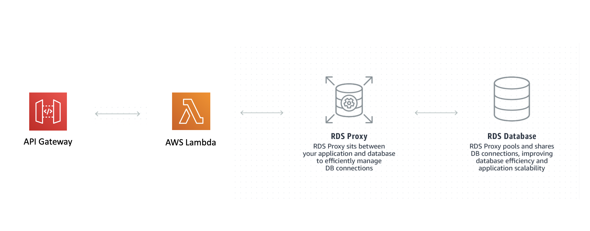

# The RDS Proxy

This is a project that has been configured with a MySQL RDS DB, an RDS Proxy, a Lambda Function to run queries and an API Gateway HTTP API to trigger the lambda function.

A VPC is included in this project that has the RDS Subnets configured and custom security groups for allowing communication between Lambda -> Proxy -> MySQL.

Some Useful References:

| Author        | Link           |
| ------------- | ------------- |
| AWS RDS Proxy | [RDS Proxy Site](https://aws.amazon.com/rds/proxy/) |
| AWS User Guide | [Managing Connections with Amazon RDS Proxy](https://docs.aws.amazon.com/AmazonRDS/latest/UserGuide/rds-proxy.html)
| Ben Smith   | [Introducing the serverless LAMP stack - part 2](https://aws.amazon.com/blogs/compute/introducing-the-serverless-lamp-stack-part-2-relational-databases/)  |
| George Mao | [Using Amazon RDS Proxy with AWS Lambda](https://aws.amazon.com/blogs/compute/using-amazon-rds-proxy-with-aws-lambda/)
| SSL Cert for RDS MySQL | [AmazonRootCA1.pem](https://www.amazontrust.com/repository/AmazonRootCA1.pem) |
| AWS User Guide | [Manual Steps for RDS Creation](https://docs.aws.amazon.com/AmazonRDS/latest/UserGuide/CHAP_Tutorials.WebServerDB.CreateDBInstance.html) |
| AWS User Guide | [MySQL in Amazon RDS](https://docs.aws.amazon.com/AmazonRDS/latest/UserGuide/CHAP_MySQL.html) |
| Node MySQL Lib | [MySQL](https://github.com/mysqljs/mysql) |
| AWS Docs | [Secrets Manager JS SDK Docs](https://docs.aws.amazon.com/AWSJavaScriptSDK/latest/AWS/SecretsManager.html) |
| AWS User Guide | [Creating and Retrieving a Secret](https://docs.aws.amazon.com/secretsmanager/latest/userguide/tutorials_basic.html) |

# Available Versions

* [TypeScript](typescript)
* [Python](python)

The [AWS Well-Architected](https://aws.amazon.com/architecture/well-architected/) Framework helps you understand the pros and cons of
decisions you make while building systems on AWS. By using the Framework, you will learn architectural best practices for designing and operating reliable, secure, efficient, and cost-effective systems in the cloud. It provides a way for you to consistently measure your architectures against best practices and identify areas for improvement.

We believe that having well-architected systems greatly increases the likelihood of business success.

[Serverless Lens Whitepaper](https://d1.awsstatic.com/whitepapers/architecture/AWS-Serverless-Applications-Lens.pdf)  
[Well Architected Whitepaper](http://d0.awsstatic.com/whitepapers/architecture/AWS_Well-Architected_Framework.pdf)

### The Reliability Pillar

<strong>Note -</strong> The content for this section is a subset of the [Serverless Lens Whitepaper](https://d1.awsstatic.com/whitepapers/architecture/AWS-Serverless-Applications-Lens.pdf) with some minor tweaks.

The [reliability pillar](https://d1.awsstatic.com/whitepapers/architecture/AWS-Serverless-Applications-Lens.pdf#page=48) includes the ability of a system to recover from infrastructure or service disruptions, dynamically acquire computing resources to meet demand, and mitigate disruptions such as misconfigurations or transient network issues.

> REL 1: How are you regulating inbound request rates?

Best Practices:

Use mechanisms to protect non-scalable resources: Functions can scale faster than traditional resources, such as relational databases and cache systems. Protect non-scalable resources by adapting fast scaling components to downstream systems throughput.

For relational databases such as Amazon RDS, you can limit the number of connections per user in addition to the global maximum number of connections.

## What is Included In This Pattern?

This pattern is a version of [the scalable webhook](https://github.com/cdk-patterns/serverless/blob/master/the-scalable-webhook/README.md) built using AWS RDS Proxy. 

You get a MySQL Database setup inside a VPC with appropriate subnets and security groups to connect with an RDS Proxy. That RDS Proxy is then communicated with via a Lambda Function / API Gateway HTTP API.

The big benefit here is that you are using fully managed infrastructure to protect the RDS DB, you have not needed to spin up your own queue and mechanism for how rapidly to pull from it.