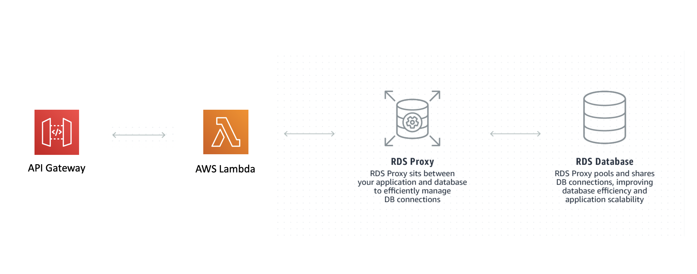

# The RDS Proxy

This is a project that has been configured with a MySQL RDS DB, an RDS Proxy, a Lambda Function to run queries and an API Gateway HTTP API to trigger the lambda function.

A VPC is included in this project that has the RDS Subnets configured and custom security groups for allowing communication between Lambda -> Proxy -> MySQL.

Some Useful References:

| Author        | Link           |
| ------------- | ------------- |
| AWS RDS Proxy | [RDS Proxy Site](https://aws.amazon.com/rds/proxy/) |
| AWS User Guide | [Managing Connections with Amazon RDS Proxy](https://docs.aws.amazon.com/AmazonRDS/latest/UserGuide/rds-proxy.html)
| Ben Smith   | [Introducing the serverless LAMP stack - part 2](https://aws.amazon.com/blogs/compute/introducing-the-serverless-lamp-stack-part-2-relational-databases/)  |
| George Mao | [Using Amazon RDS Proxy with AWS Lambda](https://aws.amazon.com/blogs/compute/using-amazon-rds-proxy-with-aws-lambda/)
| SSL Cert for RDS MySQL | [AmazonRootCA1.pem](https://www.amazontrust.com/repository/AmazonRootCA1.pem) |
| AWS User Guide | [Manual Steps for RDS Creation](https://docs.aws.amazon.com/AmazonRDS/latest/UserGuide/CHAP_Tutorials.WebServerDB.CreateDBInstance.html) |
| AWS User Guide | [MySQL in Amazon RDS](https://docs.aws.amazon.com/AmazonRDS/latest/UserGuide/CHAP_MySQL.html) |
| Node MySQL Lib | [MySQL](https://github.com/mysqljs/mysql) |
| AWS Docs | [Secrets Manager JS SDK Docs](https://docs.aws.amazon.com/AWSJavaScriptSDK/latest/AWS/SecretsManager.html) |
| AWS User Guide | [Creating and Retrieving a Secret](https://docs.aws.amazon.com/secretsmanager/latest/userguide/tutorials_basic.html) |

# Available Versions

* [TypeScript](typescript)
* [Python](python)

The [AWS Well-Architected](https://aws.amazon.com/architecture/well-architected/) Framework helps you understand the pros and cons of
decisions you make while building systems on AWS. By using the Framework, you will learn architectural best practices for designing and operating reliable, secure, efficient, and cost-effective systems in the cloud. It provides a way for you to consistently measure your architectures against best practices and identify areas for improvement.

We believe that having well-architected systems greatly increases the likelihood of business success.

[Serverless Lens Whitepaper](https://d1.awsstatic.com/whitepapers/architecture/AWS-Serverless-Applications-Lens.pdf)  
[Well Architected Whitepaper](http://d0.awsstatic.com/whitepapers/architecture/AWS_Well-Architected_Framework.pdf)

### The Reliability Pillar

<strong>Note -</strong> The content for this section is a subset of the [Serverless Lens Whitepaper](https://d1.awsstatic.com/whitepapers/architecture/AWS-Serverless-Applications-Lens.pdf) with some minor tweaks.

The [reliability pillar](https://d1.awsstatic.com/whitepapers/architecture/AWS-Serverless-Applications-Lens.pdf#page=48) includes the ability of a system to recover from infrastructure or service disruptions, dynamically acquire computing resources to meet demand, and mitigate disruptions such as misconfigurations or transient network issues.

> REL 1: How are you regulating inbound request rates?

Best Practices:

Use mechanisms to protect non-scalable resources: Functions can scale faster than traditional resources, such as relational databases and cache systems. Protect non-scalable resources by adapting fast scaling components to downstream systems throughput.

For relational databases such as Amazon RDS, you can limit the number of connections per user in addition to the global maximum number of connections.

## What is Included In This Pattern?

This pattern is a version of [the scalable webhook](https://github.com/cdk-patterns/serverless/blob/master/the-scalable-webhook/README.md) built using AWS RDS Proxy. 

You get a MySQL Database setup inside a VPC with appropriate subnets and security groups to connect with an RDS Proxy. That RDS Proxy is then communicated with via a Lambda Function / API Gateway HTTP API.

The big benefit here is that you are using fully managed infrastructure to protect the RDS DB, you have not needed to spin up your own queue and mechanism for how rapidly to pull from it.

For the AWS official benefits see [this page](https://aws.amazon.com/rds/proxy/#Benefits)

### VPC
The VPC bundled with this pattern is the default one setup by the CDK L2 construct. In a production system you would want to tailor this to your needs

### Security Groups
I bundled 2 security groups lambdaToRDSProxyGroup and dbConnectionGroup.

dbConnectionGroup allows TCP traffic on port 3306 from other peers within this group. It also allows TCP traffic on port 3306 for peers within the lambdaToRDSProxyGroup group.

I added the second group because I saw no need for peers to be allowed to hit the Lambda Function with TCP traffic on 3306. This separated the capability.

### Auto Generated Password and Username in Secrets Manager
The username is a static value but we use secrets manager to generate the password to be used for our DB. We then give our Lambda Function permissions to read this secret so that it can connect to the DB. That means the only value that needs to be shared as an environment variable is the secret name,

### MySQL RDS Instance
This is just a small, burstable instance using MySQL 5.7.22. I have removed the deletion protection and told Cloudformation to delete it on stack deletion because this is a learning stack. In a production stack, never use these two properties.

### RDS Proxy
This is what we are using to protect the MySQL DB which is a small instance from the massively scalable Lambda Function that will be querying it. The proxy makes sure we do not overload it and shares connections between queries.

### Lambda Function
This reads our username and password for our proxy from Secrets Manager then uses the MySQL library to create a database and table if they do not exist then insert a record for the url you hit on the API Gateway. Finally it queries the database for all records stored and returns them.

### API Gateway HTTP API
Any url you hit on this gateway will integrate with the Lambda Function

## Testing The Pattern

After you deploy this pattern you will have an API Gateway HTTP API where any url you hit gets routed to a Lambda function that inserts the URL path you hit into our MySQL table.

Simply open the url printed out in the deployment logs for our HTTP API in a browser and you should see a table containing all the urls you have hit. Try hitting a couple of different urls and watch the table grow.

## Useful commands

 * `npm run build`   compile typescript to js
 * `npm run watch`   watch for changes and compile
 * `npm run test`    perform the jest unit tests
 * `npm run deploy`      deploy this stack to your default AWS account/region
 * `cdk diff`        compare deployed stack with current state
 * `cdk synth`       emits the synthesized CloudFormation template
