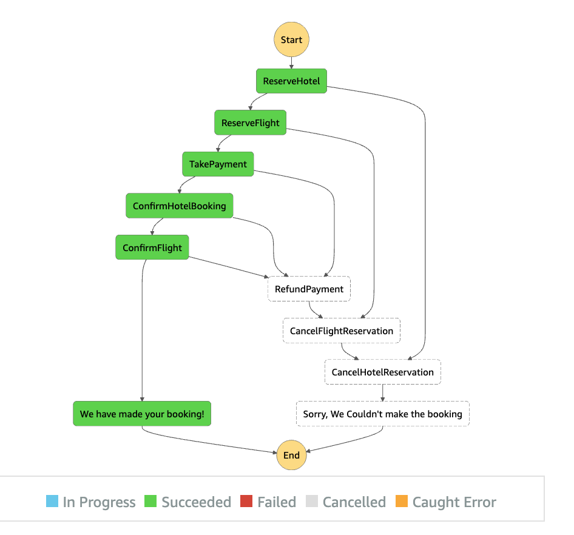
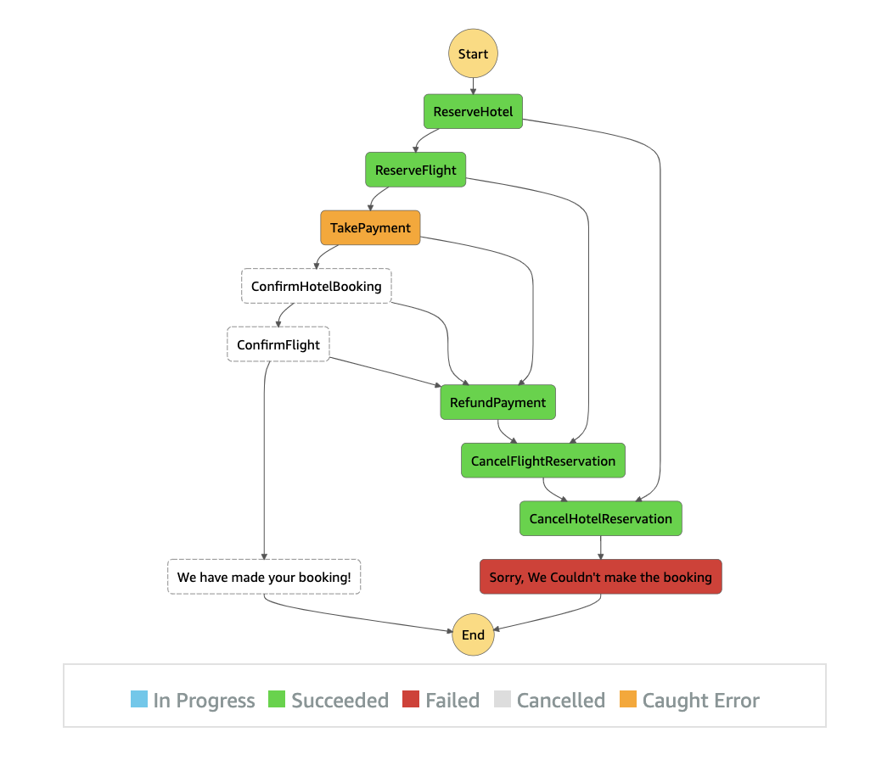
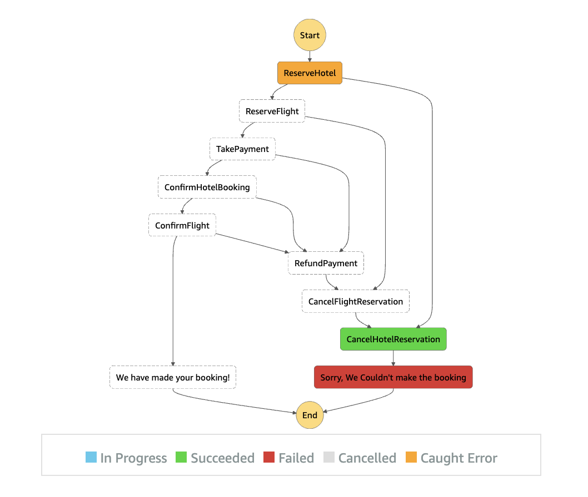
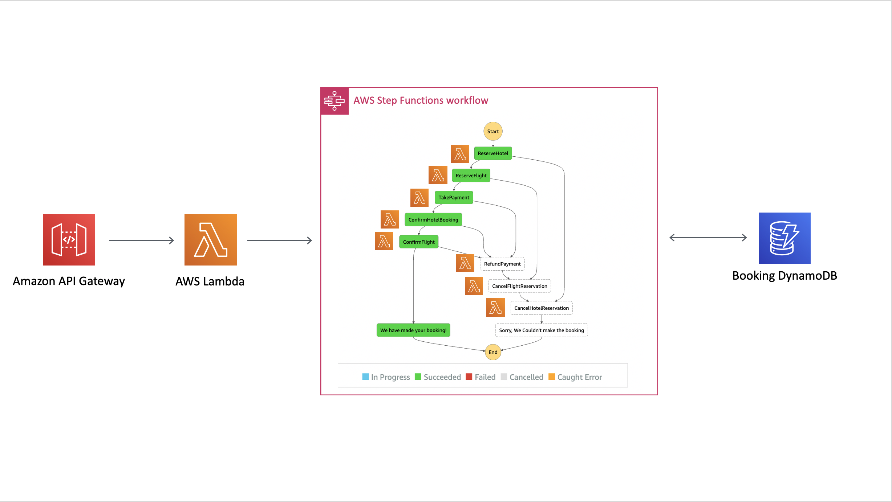

# The Saga Step Function

This is a pattern that I found via [Yan Cui](https://twitter.com/theburningmonk) and his 2017 [Blog Post](https://theburningmonk.com/2017/07/applying-the-saga-pattern-with-aws-lambda-and-step-functions/). 

After doing research I found some other references:

| Author        | Link           |
| ------------- | ------------- |
| Hector Garcia-Molina      | [Research Paper](http://www.cs.cornell.edu/andru/cs711/2002fa/reading/sagas.pdf) |
| [Yan Cui](https://twitter.com/theburningmonk)      | [Blog Post](https://theburningmonk.com/2017/07/applying-the-saga-pattern-with-aws-lambda-and-step-functions/) |
| [Caitie McCaffrey](https://twitter.com/caitie)      | [](https://www.youtube.com/watch?v=xDuwrtwYHu8)      |
| [Heitor Lessa](https://twitter.com/heitor_lessa) | [AWS Serverless Airline Booking Example](https://github.com/aws-samples/aws-serverless-airline-booking/tree/develop/src/backend/booking#booking-state-machine)      |
| [Jeremy Daly](https://twitter.com/jeremy_daly) | [EventBridge Saga Tweet](https://twitter.com/jeremy_daly/status/1151657527475654657)      |
| [Chris Richardson](https://twitter.com/crichardson) | [Blog Post](https://microservices.io/patterns/data/saga.html) and [Book](https://microservices.io/book)     |
| [Chaos Gears](https://medium.com/@chaosgears) | [Blog Post](https://medium.com/@chaosgears/saga-patterns-inside-step-functions-world-b330c40fb9d5) |
| [Yos Riady](https://dzone.com/users/3207440/yosriady.html) | [Blog Post](https://dzone.com/articles/distributed-sagas-for-microservices) |

## What Is The Saga Pattern?

Hector Garcia-Molina described it in his [paper](http://www.cs.cornell.edu/andru/cs711/2002fa/reading/sagas.pdf) as follows:

> Long lived transactions (LLTs) hold on to database resources for relatively long periods of
> time, signficantly delaying the termination of shorter and more common transactions To alleviate these problems we 
> propose the notion of a saga.
>
> A LLT is a saga if it can be written as a sequence of transactions that can be interleaved
with other transactions. The database management system guarantees that either all the transactions in a saga are successfully completed or compensating transactions are run to amend a partial execution.

You can think of this as a complete transaction is made up of a series of smaller tasks. We need all of these tasks to
be successful for us to call the transaction a success.

Caitie uses a holiday booking example to demonstrate this which Yan elaborated on so let's continue the trend. If you are booking a holiday let's say you need at a minimum:

* To Book Flights
* To Book A hotel
* To Pay

You wouldn't be very happy if you booked a holiday then found out when you landed that you had a reservation at the hotel but an error occured with payment so they gave it away. The saga pattern forces you to have a compensating action for that payment error, either you have some other payment selection process or you roll back the whole booking and ask the customer to try again.

Every action must have a corresponding reaction for error. Note the reaction cannot always be equal as Caitie points out, if one of the actions was to send an email you cannot undo that send but you can send a follow up to say it was an error.

If we assume from this point we will roll back when an error hits then the flow might look something like:

### Success
This flows as you might expect - we reserve a room in the hotel, a spot on the plane, take the payment, then confirm the booking with the airline and hotel. Finally we notify the customer that it was a successful booking.



### Failure
If after reserving the flight and hotel our payment fails then we need to release that reservation and notify the customer it failed.

Notice how it peels back the layers, it doesn't do one massive compensation step. It runs the cancel steps in reverse order until the system should be the way it was before we started.



If the first ReserveHotel task had failed the only difference is the number of Cancel tasks that run:



## What Does The Saga Step Function Look Like?

We have an API Gateway connected to a Lambda through a {proxy+} setup. This lambda starts a stepfunction workflow representing the flows above. 6 lambdas inside that workflow communicate with 3 different DynamoDB tables to complete a travel booking transaction:



## How Do I Test This After Deployment?

After deployment you should have an API Gateway where any url you hit triggers the step function to start.

You can manipulate the flow of the step function with a couple of url parameters:

```
Successful Execution - https://{api gateway url}
Book Hotel Fail - https://{api gateway url}?runType=failHotel
Book Flight Fail - https://{api gateway url}?runType=failFlights
Book Rental Car Fail - https://{api gateway url}?runType=failRental

Inserting Muliple trips into DynamoDB, by default it will use the same ID on every execution
https://{api gateway url}?tripID={whatever you want}

```

It is important to note that the Cancel Lambdas all have a random failure built in and retry logic up to a max of 3. So when you look at the execution of your stepfunction in the aws console if you see failures in the cancel lambdas this is intentional. The reason why is to teach you that the cancel logic should attempt to self recover in the event of an error.

To actually view what happened you will need to log into the AWS console and navigate to the step functions section where you can see every execution of your saga step function. You can also look inside the 3 DynamoDB tables at the records inserted.

## Available Versions

 * [TypeScript](typescript/)
 * [Python](python/)