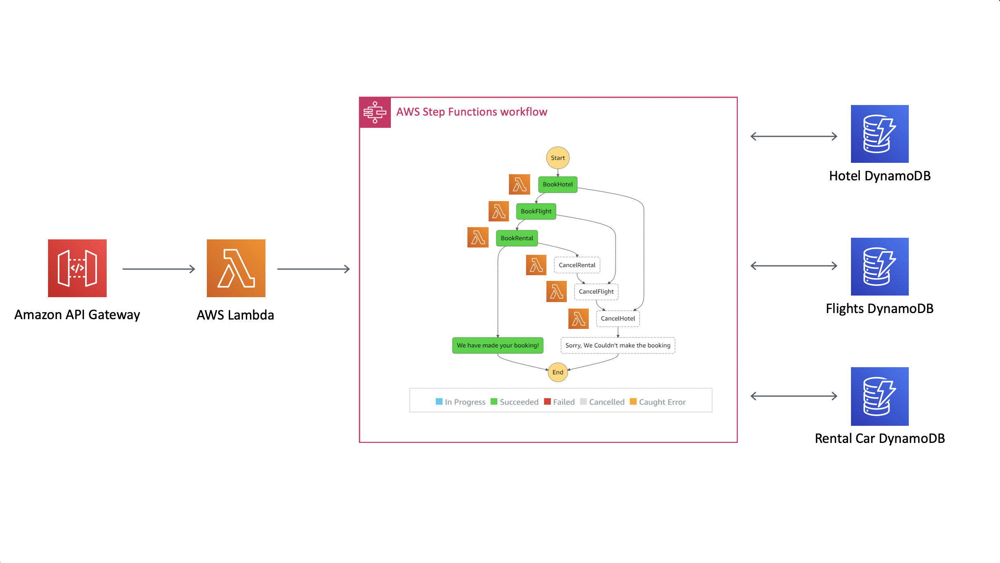

# The Saga Step Function

This is a pattern that I found via [Yan Cui](https://twitter.com/theburningmonk) and his 2017 [Blog Post](https://theburningmonk.com/2017/07/applying-the-saga-pattern-with-aws-lambda-and-step-functions/). 

He also links to a fantastic goto talk from 2015 by [Caitie McCaffrey](https://twitter.com/caitie) which I wanted to make sure doesn't get lost:

This pattern is even used by [Heitor Lessa](https://twitter.com/heitor_lessa) in the [AWS Serverless Airline Booking Example](https://github.com/aws-samples/aws-serverless-airline-booking/tree/develop/src/backend/booking#booking-state-machine)

## What Is The Saga Pattern?

Hector Garcia-Molina described it in his [paper](http://www.cs.cornell.edu/andru/cs711/2002fa/reading/sagas.pdf) as follows:

> Long lived transactions (LLTs) hold on to database resources for relatively long periods of
> time, signficantly delaying the termination of shorter and more common transactions To alleviate these problems we 
> propose the notion of a saga.
>
> A LLT is a saga if it can be written as a sequence of transactions that can be interleaved
with other transactions. The database management system guarantees that either all the transactions in a saga are successfully completed or compensating transactions are run to amend a partial execution.

You can think of this as a complete transaction is made up of a series of smaller tasks. We need all of these tasks to
be successful for us to call the transaction a success.

Caitie uses a holiday booking example to demonstrate this which Yan elaborated on so let's continue the trend. If you are booking a holiday let's say you need at a minimum:

* Flights
* A hotel
* A rental car

You wouldn't be very happy if you booked a holiday then found out when you landed that the flights and rental car were booked but an error occured and you have no hotel. The saga pattern forces you to have a compensating action for that hotel booking error, either you have some other auto hotel selection process or you roll back the whole booking and ask the customer to pick another hotel.

Every action must have a corresponding reaction for error. Note the reaction cannot always be equal as Caitie points out, if one of the actions was to send an email you cannot undo that send but you can send a follow up to say it was an error.

If we assume from this point we will roll back when an error hits then the flow might look something like:

### Success
This flows as you might expect, we try to book a hotel, the flights and the rental car. All tasks completed successfully so we mark the transaction as a success.

### Failure
You might think of the below as a bit extreme since you wouldn't want to cancel your flights and hotel just because you couldn't get a rental car. Just go with it. In real life the rental car step probably wouldn't be part of this saga or the compensating action would be to pick another rental.

Notice though how it peels back the layers, it doesn't do one massive compensation step. It runs the cancel steps in reverse order until the system should be the way it was before we started.

If the first BookHotel task had failed the only difference is the number of Cancel tasks that run:

## What Does The Saga Step Function Look Like?

We have an API Gateway connected to a Lambda through a {proxy+} setup. This lambda starts a stepfunction workflow representing the flows above. 6 lambdas inside that workflow communicate with 3 different DynamoDB tables to complete a travel booking transaction:

