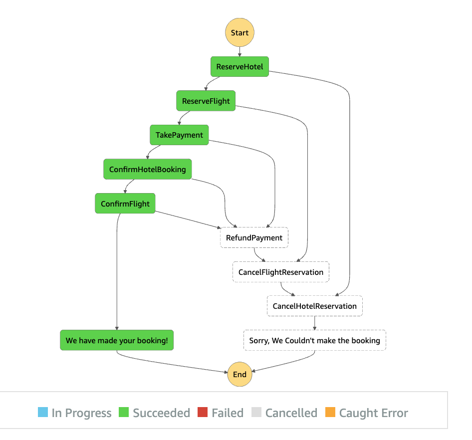
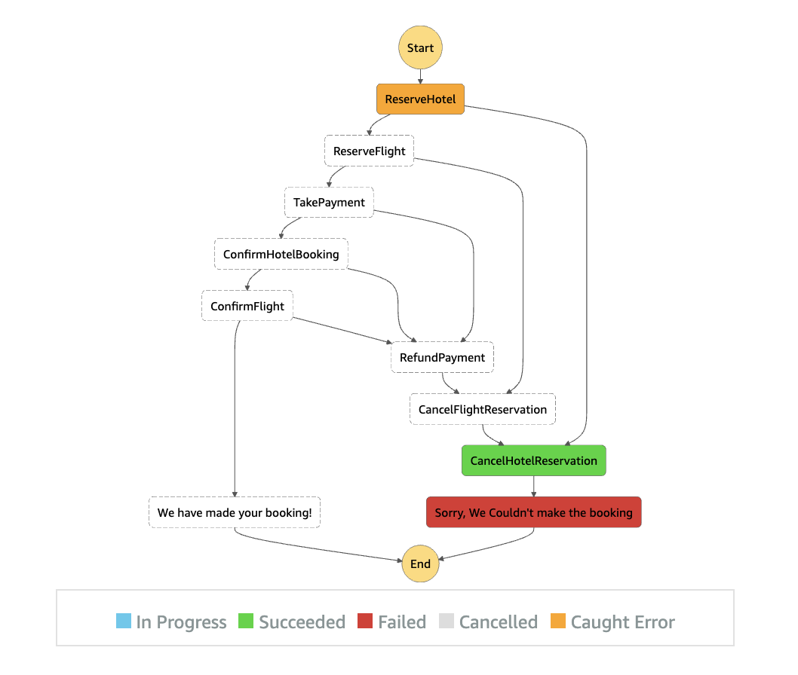
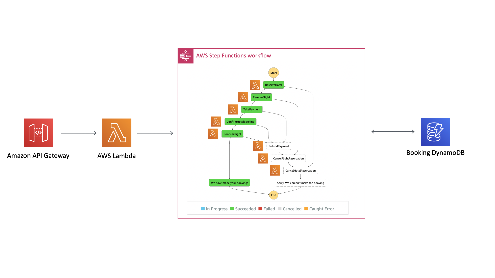
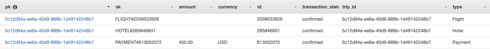

# The Saga Step Function

This is a pattern that I found via [Yan Cui](https://twitter.com/theburningmonk) and his 2017 [Blog Post](https://theburningmonk.com/2017/07/applying-the-saga-pattern-with-aws-lambda-and-step-functions/). 

After doing research I found some other references:

| Author        | Link           |
| ------------- | ------------- |
| Hector Garcia-Molina      | [Research Paper](http://www.cs.cornell.edu/andru/cs711/2002fa/reading/sagas.pdf) |
| AWS Well Architected WhitePaper | [Serverless Application Lens](https://d1.awsstatic.com/whitepapers/architecture/AWS-Serverless-Applications-Lens.pdf) |
| Implementing Microservices on AWS Whitepaper | [Implementing Microservices on AWS](https://d1.awsstatic.com/whitepapers/microservices-on-aws.pdf) |
| [Yan Cui](https://twitter.com/theburningmonk)      | [Blog Post](https://theburningmonk.com/2017/07/applying-the-saga-pattern-with-aws-lambda-and-step-functions/) |
| [Caitie McCaffrey](https://twitter.com/caitie)      | [](https://www.youtube.com/watch?v=xDuwrtwYHu8)      |
| [Heitor Lessa](https://twitter.com/heitor_lessa) | [AWS Serverless Airline Booking Example](https://github.com/aws-samples/aws-serverless-airline-booking/tree/develop/src/backend/booking#booking-state-machine) and [YouTube Recording](https://youtu.be/MyoOeHTp2pg?t=1447)     |
| [Stephen Liedig](https://twitter.com/sliedigaws) | [re:Invent Builders Session 2018](https://github.com/aws-samples/aws-step-functions-long-lived-transactions)|
| [Jeremy Daly](https://twitter.com/jeremy_daly) | [EventBridge Saga Tweet](https://twitter.com/jeremy_daly/status/1151657527475654657)      |
| [Chris Richardson](https://twitter.com/crichardson) | [Blog Post](https://microservices.io/patterns/data/saga.html) and [Book](https://microservices.io/book)     |
| [Chaos Gears](https://medium.com/@chaosgears) | [Blog Post](https://medium.com/@chaosgears/saga-patterns-inside-step-functions-world-b330c40fb9d5) |
| [Yos Riady](https://dzone.com/users/3207440/yosriady.html) | [Blog Post](https://dzone.com/articles/distributed-sagas-for-microservices) |

## Desconstructing The Saga Step Function
If you want a walkthrough of the theory, the code and finally a demo of the deployed implementation check out:

[](https://www.youtube.com/watch?v=1nJNx6_KSRU)

## What Is The Saga Pattern?

Hector Garcia-Molina described it in his [paper](http://www.cs.cornell.edu/andru/cs711/2002fa/reading/sagas.pdf) as follows:

> Long lived transactions (LLTs) hold on to database resources for relatively long periods of
> time, signficantly delaying the termination of shorter and more common transactions To alleviate these problems we 
> propose the notion of a saga.
>
> A LLT is a saga if it can be written as a sequence of transactions that can be interleaved
with other transactions. The database management system guarantees that either all the transactions in a saga are successfully completed or compensating transactions are run to amend a partial execution.

You can think of this as a complete transaction is made up of a series of smaller tasks. We need all of these tasks to
be successful for us to call the transaction a success.

Caitie uses a holiday booking example to demonstrate this which Yan elaborated on so let's continue the trend. If you are booking a holiday let's say you need at a minimum:

* To Book Flights
* To Book A hotel
* To Pay

You wouldn't be very happy if you booked a holiday then found out when you landed that you had a reservation at the hotel but an error occured with payment so they gave it away. The saga pattern forces you to have a compensating action for that payment error, either you have some other payment selection process or you roll back the whole booking and ask the customer to try again.

Every action must have a corresponding reaction for error. Note the reaction cannot always be equal as Caitie points out, if one of the actions was to send an email you cannot undo that send but you can send a follow up to say it was an error.

If we assume from this point we will roll back when an error hits then the flow might look something like:

### Success
This flows as you might expect - we reserve a room in the hotel, a spot on the plane, take the payment, then confirm the booking with the airline and hotel. Finally we notify the customer that it was a successful booking.



### Failure
If after reserving the flight and hotel our payment fails then we need to release that reservation and notify the customer it failed.

Notice how it peels back the layers, it doesn't do one massive compensation step. It runs the cancel steps in reverse order until the system should be the way it was before we started.


If the first ReserveHotel task had failed the only difference is the number of Cancel tasks that run:



## What Does The Saga Step Function Look Like?

We have an API Gateway connected to a Lambda through a {proxy+} setup. This lambda starts a stepfunction workflow representing the flows shown above. 8 lambdas inside that workflow communicate with 1 DynamoDB table to complete a travel booking transaction:



### Saga Lambda and Step Fuction Exection

The Saga Lambda is a function that takes in input from the query parameters in the url and passes them to a step function execution. The data passed to the step function looks like:

```javascript
let input = {
        "trip_id": tripID, //taken from queryParams
        "depart": "London",
        "depart_at": "2021-07-10T06:00:00.000Z",
        "arrive": "Dublin",
        "arrive_at": "2021-07-12T08:00:00.000Z",
        "hotel": "holiday inn",
        "check_in": "2021-07-10T12:00:00.000Z",
        "check_out": "2021-07-12T14:00:00.000Z",
        "rental": "Volvo",
        "rental_from": "2021-07-10T00:00:00.000Z",
        "rental_to": "2021-07-12T00:00:00.000Z",
        "run_type": runType //taken from queryParams
    };
```

### Lambdas Inside Our Step Function

| Author        | Description           |
| ------------- | ------------- |
| Reserve Hotel | Inserts a record into DynamoDB for our hotel booking with a transaction_status of pending |
| Reserve Flight | Inserts a record into DynamoDB for our flight booking with a transaction_status of pending |
| Cancel Hotel Reservation | Deletes the record from DynamoDB for our pending hotel booking |
| Cancel Flight Reservation | Deletes the record from DynamoDB for our pending Flight booking |
| Take Payment | Inserts a record into DynamoDB for the payment |
| Cancel Payment | Deletes the record from DynamoDB for the payment |
| Confirm Hotel | Updates the record in DynamoDB for transaction_status to confirmed |
| Confirm Flight | Updates the record in DynamoDB for transaction_status to confirmed |

### Error Handling and Retry Logic

If an error occurs in any of the reserve tasks, confirm tasks or the take payment task (either by you manually passing the trigger or a real error) we have step function catch logic to route to the appropriate cancel event.

You also need to account for errors in the cancel functions. That is why there is a random fail trigger in each cancel function. 

```javascript
if (Math.random() < 0.4) {
    throw new Error("Internal Server Error");
}
```

To handle this each cancel function has a built in retry policy of 3 attempts as part of the step function definition.

### DynamoDB Table

We have 3 separate entities inside the one DynamoDB table, this was inspired by [Alex Debrie](https://twitter.com/alexbdebrie) and his brilliant [book](https://www.dynamodbbook.com/). If you want to learn more about advanced single table DynamoDB patterns it is worth a purchase.

You can see that the sort key on our table is overloaded to allow us to effectively filter results:



More columns exist than is shown above. The data inserted for each record is as follows:

```javascript
// Hotel Data Model
var params = {
    TableName: process.env.TABLE_NAME,
    Item: {
      'pk' : {S: event.trip_id},
      'sk' : {S: 'HOTEL#'+hotelBookingID},
      'trip_id' : {S: event.trip_id},
      'type': {S: 'Hotel'},
      'id': {S: hotelBookingID},
      'hotel' : {S: event.hotel},
      'check_in': {S: event.check_in},
      'check_out': {S: event.check_out},
      'transaction_status': {S: 'pending'}
    }
  };

// Flights Data Model
var params = {
      TableName: process.env.TABLE_NAME,
      Item: {
        'pk' : {S: event.trip_id},
        'sk' : {S: 'FLIGHT#'+flightBookingID},
        'type': {S: 'Flight'},
        'trip_id' : {S: event.trip_id},
        'id': {S: flightBookingID},
        'depart' : {S: event.depart},
        'depart_at': {S: event.depart_at},
        'arrive': {S: event.arrive},
        'arrive_at': {S: event.arrive_at},
        'transaction_status': {S: 'pending'}
      }
    };

// Payments Data Model
var params = {
      TableName: process.env.TABLE_NAME,
      Item: {
        'pk' : {S: event.trip_id},
        'sk' : {S: 'PAYMENT#'+paymentID},
        'type': {S: 'Payment'},
        'trip_id' : {S: event.trip_id},
        'id': {S: paymentID},
        'amount': {S: "450.00"},
        'currency': {S: "USD"},
        'transaction_status': {S: "confirmed"}
      }
    };
```

## How Do I Test This After Deployment?

After deployment you should have an API Gateway where any url you hit triggers the step function to start.

You can manipulate the flow of the step function with a couple of url parameters:

```
Successful Execution - https://{api gateway url}
Reserve Hotel Fail - https://{api gateway url}?runType=failHotelReservation
Confirm Hotel Fail - https://{api gateway url}?runType=failHotelConfirmation
Reserve Flight Fail - https://{api gateway url}?runType=failFlightsReservation
Confirm Flight Fail - https://{api gateway url}?runType=failFlightsConfirmation
Take Payment Fail - https://{api gateway url}?runType=failPayment

Inserting Muliple trips into DynamoDB, by default it will use the same ID on every execution
https://{api gateway url}?tripID={whatever you want}

```

It is important to note that the Cancel Lambdas all have a random failure built in and retry logic up to a max of 3. So when you look at the execution of your stepfunction in the aws console if you see failures in the cancel lambdas this is intentional. The reason why is to teach you that the cancel logic should attempt to self recover in the event of an error. Given that they only retry 3 times it is still possible for the cancel process to fail 3 times and the step function to terminate early. 

To actually view what happened you will need to log into the AWS console and navigate to the step functions section where you can see every execution of your saga step function. You can also look inside the DynamoDB table at the records inserted. If you are fast enough with refresh you can watch them go from pending to confirmed status.

## Useful commands

 * `npm run build`   compile typescript to js
 * `npm run watch`   watch for changes and compile
 * `npm run test`    perform the jest unit tests
 * `npm run deploy`      deploy this stack to your default AWS account/region
 * `cdk diff`        compare deployed stack with current state
 * `cdk synth`       emits the synthesized CloudFormation template
