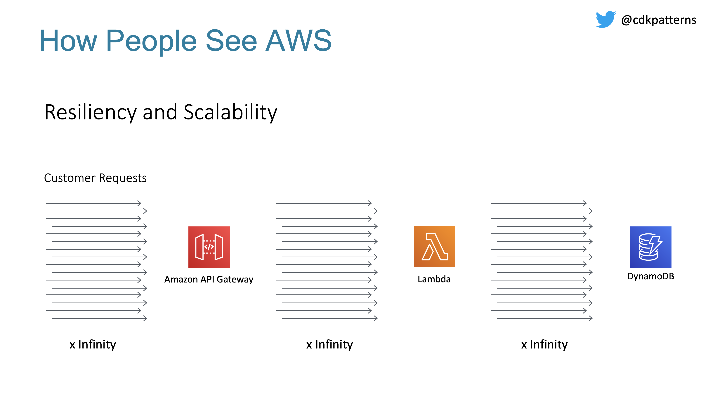
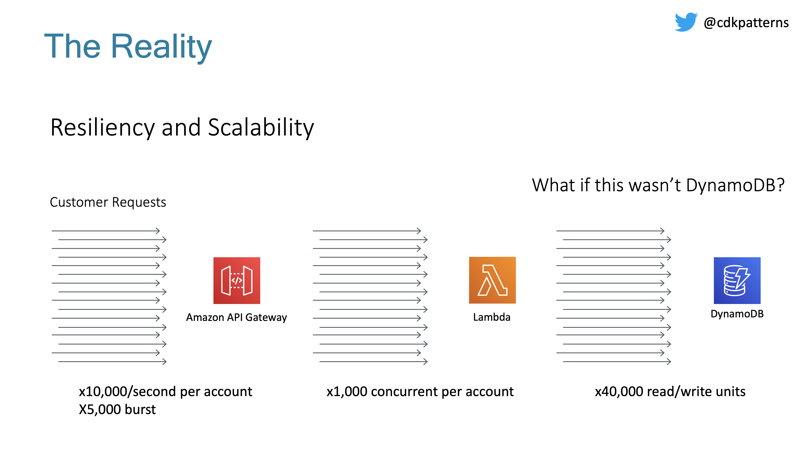
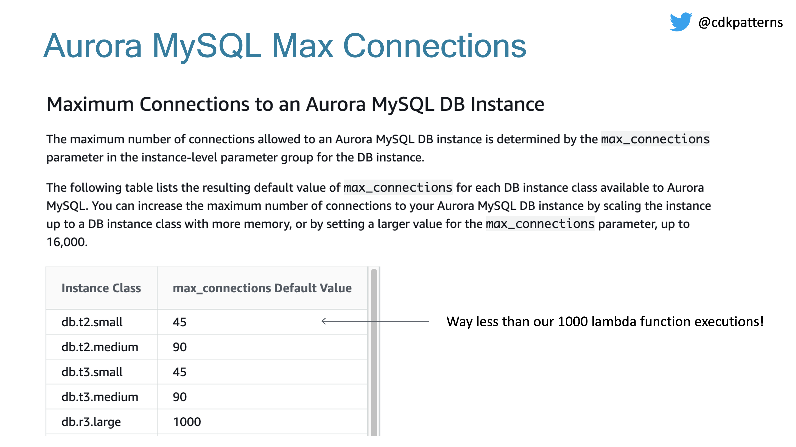
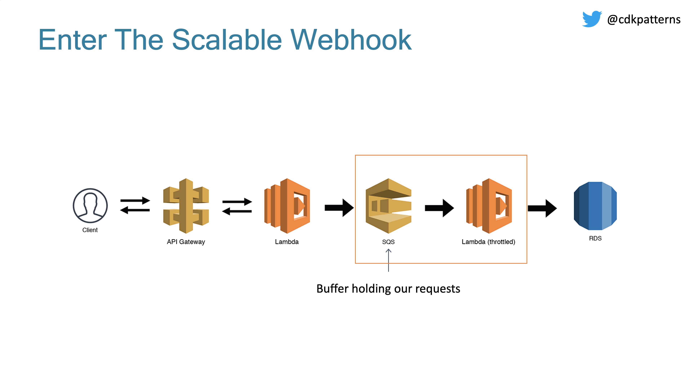
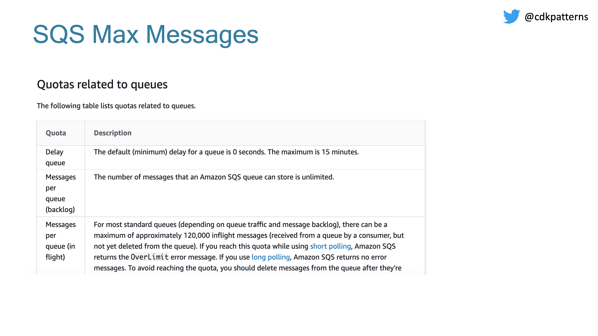
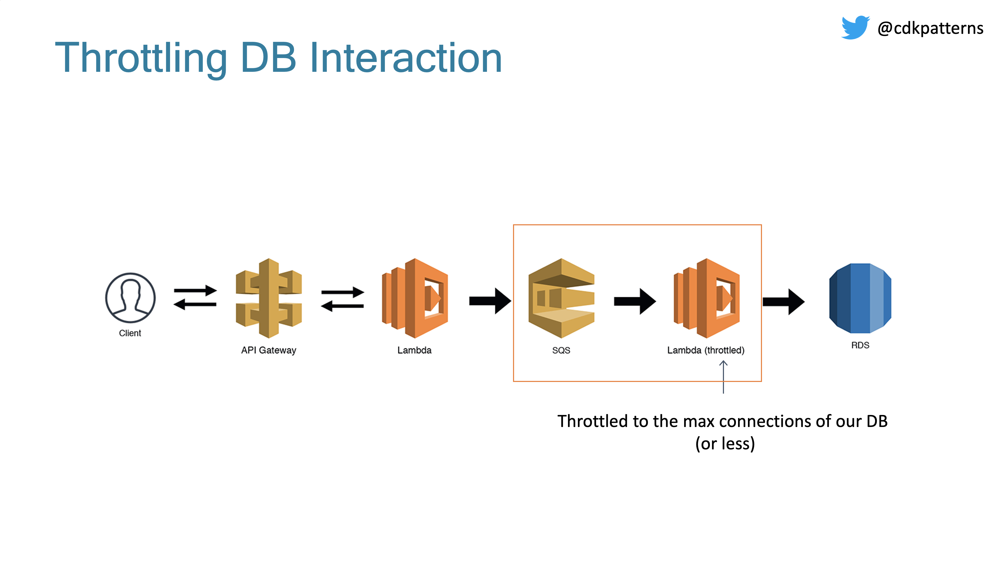
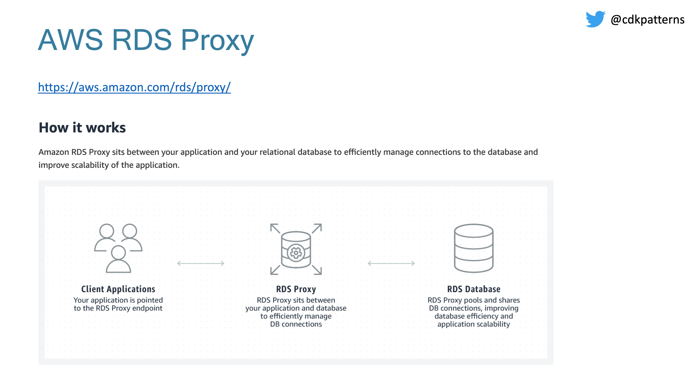

# The Scalable Webhook

This is an example CDK stack to deploy The Scalable Webhook stack described by Jeremy Daly here - https://www.jeremydaly.com/serverless-microservice-patterns-for-aws/#scalablewebhook

An advanced version of this pattern was talked about by [Heitor Lessa](https://twitter.com/heitor_lessa) at re:Invent 2019 as Call me, “Maybe” (Webhook)

* [Youtube Recording](https://www.youtube.com/watch?v=9IYpGTS7Jy0)
* [Static Slides](https://d1.awsstatic.com/events/reinvent/2019/REPEAT_3_Serverless_architectural_patterns_and_best_practices_ARC307-R3.pdf)

## Desconstructing The Scalable Webhook
If you want a walkthrough of the theory, the code and finally a demo of the deployed implementation check out:

## High Level Description
You would use this pattern when you have a non serverless resource like an RDS DB in direct contact with a serverless resource like a lambda. You need to make
sure that your serverless resource doesn&apos;t scale up to an amount that it DOS attacks your non serverless resource.

This is done by putting a queue between them and having a lambda with a throttled concurrency policy pull items off the queue and communicate with your 
serverless resource at a rate it can handle.

<strong>NOTE:</strong> For this pattern in the cdk deployable construct I have swapped RDS for DynamoDB.   Why? Because it is significantly cheaper/faster for developers to deploy and maintain, I also don't think we lose the essence of the pattern with this swap given we still do the pub/sub deduplication via SQS/Lambda and throttle the subscription lambda. RDS also introduces extra complexity in that it needs to be deployed in a VPC. I am slightly worried developers would get distracted by the extra RDS logic when the main point is the pattern. A real life implementation of this pattern could use RDS MySQL or it could be a call to an on-prem mainframe, the main purpose of the pattern is the throttling to not overload the scale-limited resource.

## Pattern Background

When people move to the cloud (especially serverless) they tend to think that this means their applications are now infinitely scalable:

For the right reasons this just isn't true. If any one person's resources were infinitely scalable then any one person could consume the whole of AWS no matter how scalable the platform.

- [View API Gateway limits](https://docs.aws.amazon.com/apigateway/latest/developerguide/api-gateway-request-throttling.html)
- [View Lambda limits](https://docs.aws.amazon.com/lambda/latest/dg/gettingstarted-limits.html)
- [View DynamoDB Limits](https://docs.aws.amazon.com/amazondynamodb/latest/developerguide/Limits.html)

If we weren't using DynamoDB, we would need to know the max connections limit configured for our instance size:

We need to slow down the amount of direct requests to our DB somehow, that is where the scalable webhook comes in:

We can use SQS to hold all requests in a queue as soon as they come in. Again, SQS will have limits:

 

120,000 in flight messages with an unlimited backlog I think will be effective enough as a buffer.

[View SQS quotas](https://docs.aws.amazon.com/AWSSimpleQueueService/latest/SQSDeveloperGuide/sqs-quotas.html)

Now we have our messages in a queue but we need to subscribe to the queue and insert the records into the DB. To do this we create a throttled lambda where we set the max number of concurrent executions to whatever scale we are happy with. This should be less than the max connections on our DB and should take into account any other Lambdas running in this account.

One final improvement that we could make if implementing this in a production system is to delete the Lambda between the API Gateway and SQS. You can do a direct integration which will reduce costs and latency:

If you want an AWS managed service to try and help with this scalability problem you can check out [AWS RDS Proxy](https://aws.amazon.com/rds/proxy/) which is in preview

## How to test pattern

When you deploy this you will have an API Gateway where any url is routed through to the publish lambda. If you modify the url from / to say /hello this url will be sent as a message via sqs to a lambda
which will insert "hello from /hello" into dynamodb as a message. You can track the progress of your message at every stage through cloudwatch as logs are printed, you can view the contents of
dynamo in the console and the contents of sqs in the console. You should also notice that SQS can include duplicate messages but in those instances you don't get two identical records in DynamoDB as 
we used an id we generated in the message as the key

## Useful commands

 * `npm run build`   compile typescript to js
 * `npm run watch`   watch for changes and compile
 * `npm run test`    perform the jest unit tests
 * `npm run deploy`      deploy this stack to your default AWS account/region
 * `cdk diff`        compare deployed stack with current state
 * `cdk synth`       emits the synthesized CloudFormation template
