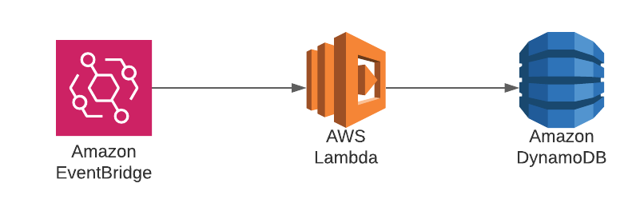

# The Scheduled Lambda

This is an example CDK stack demonstrating how to use AWS EventBridge to invoke a Lambda function on a schedule or using a cron expression. The Lambda function will then write the request ID to a DynamoDB table.



Once deployed, this stack will product a Lambda function, DynamoDB table, and an EventBridge rule.

**WARNING**: By default the EventBridge rule has been configured with a rate of 2 minutes, so you are able to quickly see the result of this example. I would strongly recommend destroying the stack using `cdk destroy TheScheduledLambdaStack` so that the scheduled run does not lead to AWS billing you for function invocations.

More information on schedule expressions for AWS EventBridge to change the run frequency of this project can be found [here](https://docs.aws.amazon.com/eventbridge/latest/userguide/scheduled-events.html).

## Useful CDK Commands

The `cdk.json` file tells the CDK Toolkit how to execute your app.

This project is set up like a standard Python project.  The initialization
process also creates a virtualenv within this project, stored under the `.venv`
directory.  To create the virtualenv it assumes that there is a `python3`
(or `python` for Windows) executable in your path with access to the `venv`
package. If for any reason the automatic creation of the virtualenv fails,
you can create the virtualenv manually.

To manually create a virtualenv on MacOS and Linux:

```
$ python3 -m venv .venv
```

After the init process completes and the virtualenv is created, you can use the following
step to activate your virtualenv.

```
$ source .venv/bin/activate
```

If you are a Windows platform, you would activate the virtualenv like this:

```
% .venv\Scripts\activate.bat
```

Once the virtualenv is activated, you can install the required dependencies.

```
$ pip install -r requirements.txt
```

At this point you can now synthesize the CloudFormation template for this code.

```
$ cdk synth
```

To add additional dependencies, for example other CDK libraries, just add
them to your `setup.py` file and rerun the `pip install -r requirements.txt`
command.

## Useful commands

 * `cdk ls`          list all stacks in the app
 * `cdk synth`       emits the synthesized CloudFormation template
 * `cdk deploy`      deploy this stack to your default AWS account/region
 * `cdk diff`        compare deployed stack with current state
 * `cdk docs`        open CDK documentation

Enjoy!
