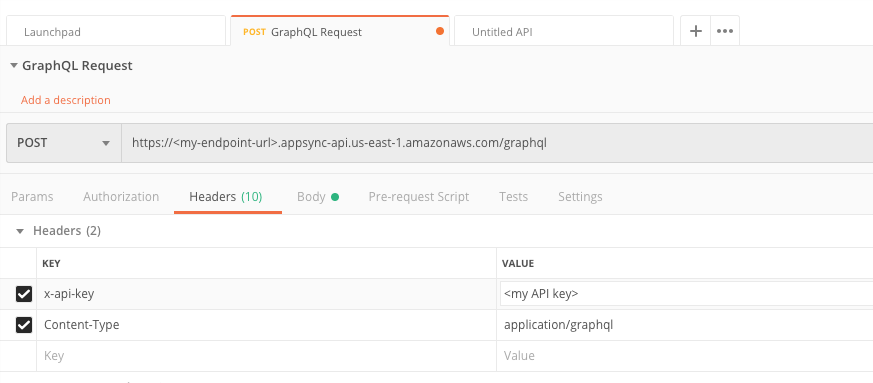
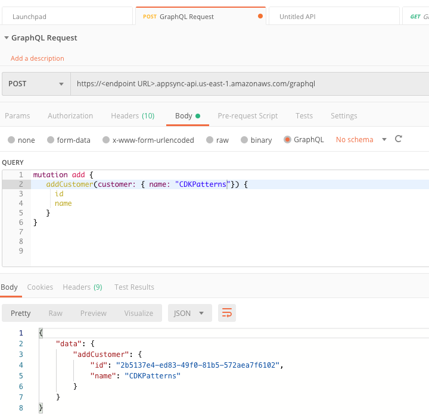

# The Simple GraphQL Service


This is an example CDK stack to deploy The Simple [GraphQL](https://graphql.org/) Service inspired by [Thorsten Hoeger](https://twitter.com/hoegertn)'s contributions to the [CDK AppSync Module example]( https://docs.aws.amazon.com/cdk/api/latest/docs/aws-appsync-readme.html#usage-example)

An advanced version of this pattern was talked about by [Heitor Lessa](https://twitter.com/heitor_lessa) at re:Invent 2019 as "The Cherry Pick".

* [Youtube Recording](https://www.youtube.com/watch?v=9IYpGTS7Jy0)
* [Static Slides](https://d1.awsstatic.com/events/reinvent/2019/REPEAT_3_Serverless_architectural_patterns_and_best_practices_ARC307-R3.pdf)

This is the most basic of [AppSync](https://aws.amazon.com/appsync/) implementations and would have to be hardened before production use. e.g. cognito user pools configured

**Note, never print your API Key to the logs in a production system. This was added to make learning AppSync and GraphQL easier. If you want to use this pattern in a production system remove the two cloudformation outputs**

### Testing

1. After CDK Deploy, capture outputs from the log.

```json
TheSimpleGraphqlServiceStack: deploying...
TheSimpleGraphqlServiceStack: creating CloudFormation changeset...

   TheSimpleGraphqlServiceStack

Outputs:
TheSimpleGraphqlServiceStack.APIKey = <API Key>
TheSimpleGraphqlServiceStack.Endpoint = https://<endpoint URL>.appsync-api.us-east-1.amazonaws.com/graphql
```

2. Setup Postman as outlined in Postman's [Using GraphQL Instructions](https://learning.postman.com/docs/postman/sending-api-requests/graphql/)

3. Set POST request URL, x-api-key and Content-Type
* x-api-key = 'your API Key'
* Content-Type = application/graphql



4. Execute Mutations and Queries to exercice resolvers to dynamo and Lambda datasources



```json
// Inserts to Dynamo
mutation add {
  addCustomer(customer: { name: "CDKPatterns"}) {
    id
    name
  }
}

// Queries the Dynamo DB
query getCustomers {
  getCustomers{id name}
}

// Executes the Lambda
query getLoyalty {
  getLoyaltyLevel { level }
}
```

# CDK Python Useful Commands

The `cdk.json` file tells the CDK Toolkit how to execute your app.

This project is set up like a standard Python project.  The initialization
process also creates a virtualenv within this project, stored under the .env
directory.  To create the virtualenv it assumes that there is a `python3`
(or `python` for Windows) executable in your path with access to the `venv`
package. If for any reason the automatic creation of the virtualenv fails,
you can create the virtualenv manually.

To manually create a virtualenv on MacOS and Linux:

```
$ python -m venv .env
```

After the init process completes and the virtualenv is created, you can use the following
step to activate your virtualenv.

```
$ source .env/bin/activate
```

If you are a Windows platform, you would activate the virtualenv like this:

```
% .env\Scripts\activate.bat
```

Once the virtualenv is activated, you can install the required dependencies.

```
$ pip install -r requirements.txt
```

At this point you can now synthesize the CloudFormation template for this code.

```
$ cdk synth
```

To add additional dependencies, for example other CDK libraries, just add
them to your `setup.py` file and rerun the `pip install -r requirements.txt`
command.

## Useful commands

 * `cdk ls`          list all stacks in the app
 * `cdk synth`       emits the synthesized CloudFormation template
 * `cdk deploy`      deploy this stack to your default AWS account/region
 * `cdk diff`        compare deployed stack with current state
 * `cdk docs`        open CDK documentation

Enjoy!
