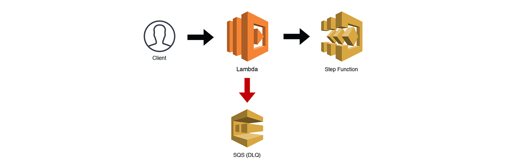

# The State Machine

This is an example CDK stack to deploy The State Machine stack described by Jeremy Daly here - https://www.jeremydaly.com/serverless-microservice-patterns-for-aws/#statemachine

After deployment you should have a proxy api gateway where any url hits a lambda which triggers a step function

## Useful commands

 * `npm run build`   compile typescript to js
 * `npm run watch`   watch for changes and compile
 * `npm run test`    perform the jest unit tests
 * `npm run deploy`      deploy this stack to your default AWS account/region
 * `cdk diff`        compare deployed stack with current state
 * `cdk synth`       emits the synthesized CloudFormation template
