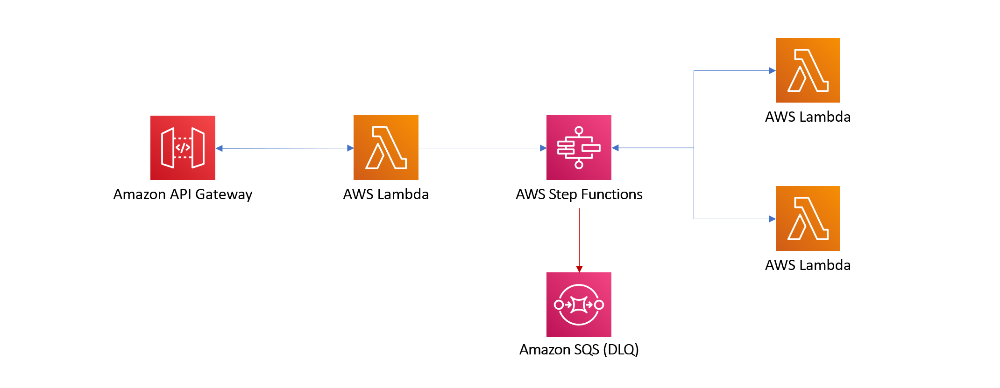
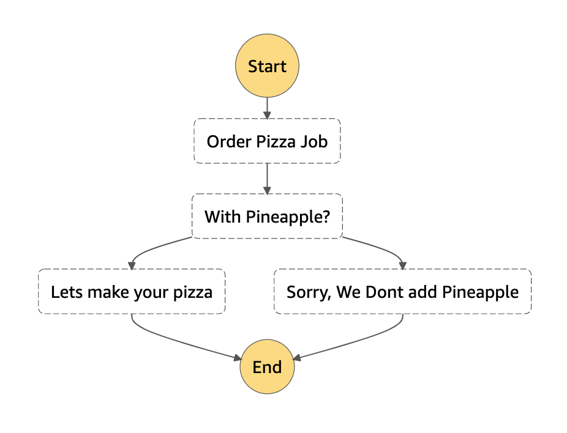

# The State Machine

This is an example CDK stack to deploy The State Machine stack described by Jeremy Daly here - https://www.jeremydaly.com/serverless-microservice-patterns-for-aws/#statemachine

You would use this pattern if you can do your processing asynchronously and you need to have different flows in your logic.

### Stepfunction Logic

### Testing It Out

After deployment you should have a proxy api gateway where any url hits a lambda which triggers a step function. You can pass in a queryparameter like '?flavour=pepperoni' or '?flavour=pineapple'.

If you pass in pineapple or hawaiian you should see the step function flow fail when you check it via the console.

## Useful commands

 * `npm run build`   compile typescript to js
 * `npm run watch`   watch for changes and compile
 * `npm run test`    perform the jest unit tests
 * `npm run deploy`      deploy this stack to your default AWS account/region
 * `cdk diff`        compare deployed stack with current state
 * `cdk synth`       emits the synthesized CloudFormation template
