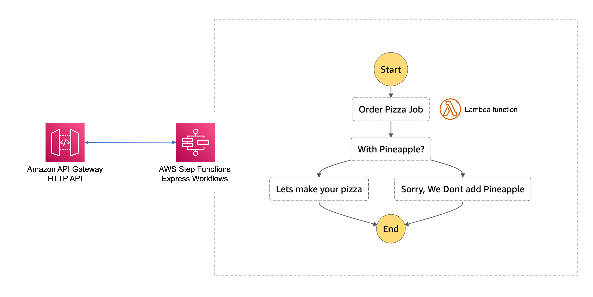

# The State Machine

This is an example CDK stack to deploy The State Machine stack described by Jeremy Daly here - https://www.jeremydaly.com/serverless-microservice-patterns-for-aws/#statemachine

You would use this pattern for simple or complex business logic in a synchronous or an asynchronous setup. Step Functions come with lots of built in robustness features that will reduce your code liability 




### Testing It Out

After deployment you should have an API Gateway HTTP API where on the base url you can send a POST request with a payload in the following format:

```json
// for a succesful execution
{
    "flavour": "pepperoni"
}

//to see a failure
{
    "flavour": "pineapple"
}
```

If you pass in pineapple or hawaiian you should see the step function flow fail in the response payload

The response returned is the raw and full output from the step function so will look something like this:

```json
// A successful execution, note the status of SUCCEEDED
{
    "billingDetails": {
        "billedDurationInMilliseconds": 500,
        "billedMemoryUsedInMB": 64
    },
    "executionArn": "arn:aws:...",
    "input": "{ \"flavour\": \"pepperoni\"}",
    "inputDetails": {
        "__type": "com.amazonaws.swf.base.model#CloudWatchEventsExecutionDataDetails",
        "included": true
    },
    "name": "6e520263-96db-4b80-9b70-659a6972c806",
    "output": "{\"containsPineapple\":false}",
    "outputDetails": {
        "__type": "com.amazonaws.swf.base.model#CloudWatchEventsExecutionDataDetails",
        "included": true
    },
    "startDate": 1.629880767853E9,
    "stateMachineArn": "arn:aws:...",
    "status": "SUCCEEDED",
    "stopDate": 1.629880768343E9,
    "traceHeader": "Root=1-612601bf-c54eff48a04f8cc9ce170772;Sampled=1"
}

// a failed execution, notice status: FAILED and the cause/error properties
{
    "billingDetails": {
        "billedDurationInMilliseconds": 500,
        "billedMemoryUsedInMB": 64
    },
    "cause": "They asked for Pineapple",
    "error": "Failed To Make Pizza",
    "executionArn": "arn:aws:...",
    "input": "{ \"flavour\": \"pineapple\"}",
    "inputDetails": {
        "__type": "com.amazonaws.swf.base.model#CloudWatchEventsExecutionDataDetails",
        "included": true
    },
    "name": "26d19050-7f9a-4b08-bea3-4106a403774f",
    "outputDetails": {
        "__type": "com.amazonaws.swf.base.model#CloudWatchEventsExecutionDataDetails",
        "included": true
    },
    "startDate": 1.629883060124E9,
    "stateMachineArn": "arn:aws:...",
    "status": "FAILED",
    "stopDate": 1.629883060579E9,
    "traceHeader": "Root=1-61260ab4-8c35f155b7a908d900562f1e;Sampled=1"
}
```

# CDK Useful Commands

The `cdk.json` file tells the CDK Toolkit how to execute your app.

This project is set up like a standard Python project.  The initialization
process also creates a virtualenv within this project, stored under the .env
directory.  To create the virtualenv it assumes that there is a `python3`
(or `python` for Windows) executable in your path with access to the `venv`
package. If for any reason the automatic creation of the virtualenv fails,
you can create the virtualenv manually.

To manually create a virtualenv on MacOS and Linux:

```
$ python -m venv .env
```

After the init process completes and the virtualenv is created, you can use the following
step to activate your virtualenv.

```
$ source .env/bin/activate
```

If you are a Windows platform, you would activate the virtualenv like this:

```
% .env\Scripts\activate.bat
```

Once the virtualenv is activated, you can install the required dependencies.

```
$ pip install -r requirements.txt
```

At this point you can now synthesize the CloudFormation template for this code.

```
$ cdk synth
```

To add additional dependencies, for example other CDK libraries, just add
them to your `setup.py` file and rerun the `pip install -r requirements.txt`
command.

## Useful commands

 * `cdk ls`          list all stacks in the app
 * `cdk synth`       emits the synthesized CloudFormation template
 * `cdk deploy`      deploy this stack to your default AWS account/region
 * `cdk diff`        compare deployed stack with current state
 * `cdk docs`        open CDK documentation

Enjoy!
