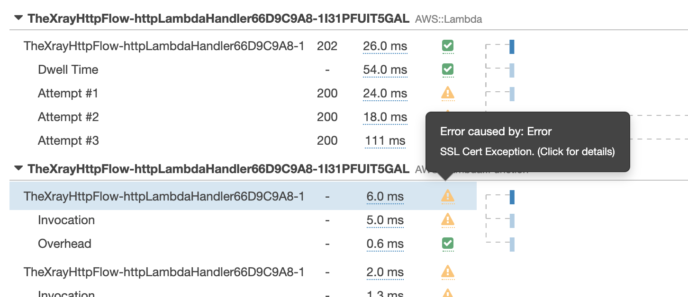

# The X-Ray Tracer

This is a pattern not defined by the components used but how they send information back to the AWS X-Ray service to help you make your application perform better when viewed through the Serverless [Well-Architected](https://aws.amazon.com/architecture/well-architected/) lens.

[X-Ray Developer Guide](https://docs.amazonaws.cn/en_us/xray/latest/devguide/xray-guide.pdf)

## Well Architected Framework

The [AWS Well-Architected](https://aws.amazon.com/architecture/well-architected/) Framework helps you understand the pros and cons of
decisions you make while building systems on AWS. By using the Framework, you will learn architectural best practices for designing and operating reliable, secure, efficient, and cost-effective systems in the cloud. It provides a way for you to consistently measure your architectures against best practices and identify areas for improvement.

We believe that having well-architected systems greatly increases the likelihood of business success.

[Serverless Lens Whitepaper](https://d1.awsstatic.com/whitepapers/architecture/AWS-Serverless-Applications-Lens.pdf)  
[Well Architected Whitepaper](http://d0.awsstatic.com/whitepapers/architecture/AWS_Well-Architected_Framework.pdf)

### The Operational Excellence Pillar

<strong>Note -</strong> The content for this section is a subset of the [Serverless Lens Whitepaper](https://d1.awsstatic.com/whitepapers/architecture/AWS-Serverless-Applications-Lens.pdf) with some minor tweaks.

The [operational excellence pillar](https://d1.awsstatic.com/whitepapers/architecture/AWS-Serverless-Applications-Lens.pdf#page=28) includes the ability to run and monitor systems to deliver business value and to continually improve supporting processes and procedures.

> OPS 1: How do you understand the health of your Serverless application?

#### Distributed Tracing
Similar to non-serverless applications, anomalies can occur at larger scale in distributed systems. Due to the nature of serverless architectures, it’s fundamental to have distributed tracing.

Making changes to your serverless application entails many of the same principles of deployment, change, and release management used in traditional workloads. However, there are subtle changes in how you use existing tools to accomplish these principles.

<strong>Active tracing with AWS X-Ray should be enabled to provide distributed tracing capabilities as well as to enable visual service maps for faster troubleshooting</strong>. 

X-Ray helps you identify performance degradation and quickly understand anomalies, including latency distributions.

Service Maps are helpful to understand integration points that need attention and resiliency practices. For integration calls, retries, backoffs, and possibly circuit breakers are necessary to prevent faults from propagating to downstream services. 

Another example is networking anomalies. You should not rely on default timeouts and retry settings. Instead, tune them to fail fast if a socket read/write timeout happens where the default can be seconds if not minutes in certain clients.

X-Ray also provides two powerful features that can improve the efficiency on identifying anomalies within applications: Annotations and Subsegments.
Subsegments are helpful to understand how application logic is constructed and what external dependencies it has to talk to. Annotations are key-value pairs with string, number, or Boolean values that are automatically indexed by AWS X-Ray.

Combined, they can help you quickly identify performance statistics on specific
operations and business transactions, for example, how long it takes to query a
database, or how long it takes to process pictures with large crowds.

## What is Included In This Pattern?

I wanted to make this pattern as "real" as possible for people so I included most of the serverless components you will use everyday. I have included:

- API Gateway -> SNS -> Lambda (not SQS for reasons [documented later](#sqs---lambda-traces))
- Lambda -> DynamoDB
- Lambda -> SQS -> Lambda
- Lambda -> External Http Endpoint
- Lambda -> SNS -> Lambda

Which produces an X-Ray service map something like (You get two circles per Lambda):

## Deliberate Random Errors

I introduced a random SSL Cert error into the Lambda that connects to the External Http Endpoint to let you experiment with using X-Ray to source an error

Service map showing something isn't healthy:

Trace details showing error:

## Subsegmemts, Metadata and Annotations

### Subsegments
I have included some custom subsegments in this pattern, like "external HTTP Request" below:

These are easy to create inside the Lambda Functions:

### Metadata
You are allowed to put whole objects inside metadata, this is brilliant for showing things like the response from a webservice. 

> Metadata are key-value pairs that can have values of any type, including objects and lists, but are not indexed for use with filter expressions. Use metadata to record additional data that you want stored in the trace but don't need to use with search.

### Annotations
> Annotations are key-value pairs with string, number, or Boolean values. Annotations are indexed for use with filter expressions. Use annotations to record data that you want to use to group traces in the console, or when calling the GetTraceSummaries API.

## Known X-Ray "Quirks"

There are a couple of X-Ray quirks that I need to document upfront, I thought it better to show them than refactor the pattern to hide them then you hit one later. If these are a deal breaker for you there are other tools out there for tracing that I have been promised will integrate with no extra code changes like [Epsagon](https://epsagon.com/)

### SQS -> Lambda Traces
There is a [known bug](https://github.com/aws/aws-xray-sdk-node/issues/208) where this doesn't connect and you end up with two paths on your service map.

I have included some logic inside the SQS subscriber lambda to move an X-Ray custom subsegment trace circle from the new second flow to where it should be but this is a workaround and hopefully that bug gets closed sooner than later.

### API Gateway -> SNS through direct integration
X-Ray does work as expected with SNS when using the AWS SDK but for some reason when I do a direct integration with API Gateway through VTL the service map shows the subscribers of the SNS topic as being connected to API GW rather than SNS which is fine because I am not missing information but it's not correct. If I workout a fix for this I will update the pattern.

### Service Map Changes Design Randomly
Unlike other tracing solutions I have used that let you position all of the circles where they give a feeling of inner calmness based on personal OCD; X-Ray randomly positions the circles on every refresh which can lead to some interesting map layouts. The important thing is being able to spot anomalies which you can definitely still do so this is purely aesthetic. 

